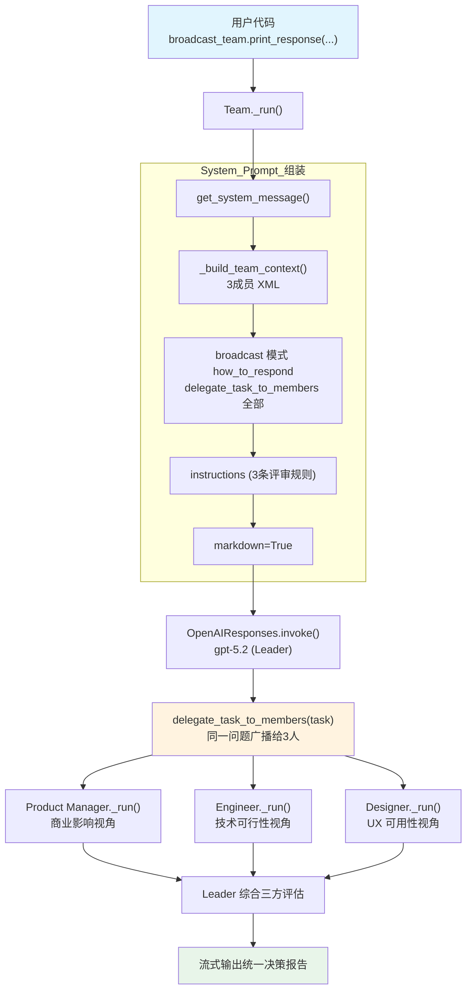

# broadcast_mode.py — 实现原理分析

> 源文件：`cookbook/03_teams/01_quickstart/broadcast_mode.py`

## 概述

本示例展示 Agno 的 **`TeamMode.broadcast` 广播模式**核心用法：Team Leader 将同一问题**同时发送给所有成员**（产品经理/工程师/设计师），收集多维专业视角后综合为统一响应。相比 `03_delegate_to_all_members.py` 的带工具研究员场景，本示例使用无工具的专家评审场景，更清晰地展示广播模式的纯「多角度决策」价值。

**核心配置一览：**

| 配置项 | 值 | 说明 |
|--------|------|------|
| `name` | `"Broadcast Review Team"` | Team 名称 |
| `model` | `OpenAIResponses(id="gpt-5.2")` | Leader 使用 Responses API |
| `mode` | `TeamMode.broadcast` | 广播模式，任务发送给全部成员 |
| `members` | `[product_manager, engineer, designer]` | 三名专家评审成员 |
| `instructions` | `[str, str, str]` | 3 条评审指令 |
| `markdown` | `True` | 启用 markdown 格式化 |
| `show_members_responses` | `True` | 显示成员 Agent 的响应 |
| `description` | `None` | 未设置 |
| `db` | `None` | 未设置 |

| 成员 | `name` | `model` | `role` | `tools` |
|------|--------|---------|--------|---------|
| product_manager | `"Product Manager"` | `OpenAIResponses(id="gpt-5.2")` | `"Assess user and business impact"` | 无 |
| engineer | `"Engineer"` | `OpenAIResponses(id="gpt-5.2")` | `"Assess technical feasibility and risks"` | 无 |
| designer | `"Designer"` | `OpenAIResponses(id="gpt-5.2")` | `"Assess UX implications and usability"` | 无 |

## 架构分层

```
用户代码层                       agno.team 层（broadcast 模式）
┌────────────────────────┐      ┌────────────────────────────────────────────┐
│ broadcast_mode.py      │      │ Team._run()                                │
│                        │      │  ├─ get_system_message()                   │
│ broadcast_team         │─────>│  │    _build_team_context()               │
│   .print_response(     │      │  │      → 开场词 + 3成员 XML              │
│     "Should we ship    │      │  │      → broadcast 模式指令              │
│      a beta autopilot  │      │  │    instructions 拼接（3条）             │
│      feature...",      │      │  │    additional_info (markdown)           │
│     stream=True,       │      │  └─ delegate_task_to_members(全部3人)      │
│   )                    │      └────────────────────────────────────────────┘
└────────────────────────┘
                                              │ Leader 调用 LLM
                                              ▼
                                    ┌─────────────────────────┐
                                    │ OpenAIResponses (Leader)  │
                                    │ gpt-5.2                   │
                                    └─────────────────────────┘
                                              │ delegate_task_to_members(task)
                                              ▼
                          ┌───────────────────────────────────────────┐
                          │ 三名成员并行/顺序接收同一任务              │
                          │  Product Manager → 商业影响评估           │
                          │  Engineer        → 技术可行性评估         │
                          │  Designer        → UX 可用性评估          │
                          └───────────────────────────────────────────┘
```

## 核心组件解析

### broadcast 模式的 delegate_task_to_members 工具

broadcast 模式使用 `delegate_task_to_members`（复数）工具，该工具将**同一任务描述**发送给 Team 的**所有成员**（`team/_default_tools.py` L750）：

```python
# team/_default_tools.py L750 — 广播工具
def delegate_task_to_members(
    task: str,
) -> Iterator[Union[RunOutputEvent, TeamRunOutputEvent, str]]:
    """Delegate the same task to ALL team members simultaneously."""
    for member in resolved_members:
        # 依次（或并行）将同一 task 发给每个成员
        yield from member.run(task, ...)
```

与 coordinate 模式 `delegate_task_to_member`（单数）的区别：

| 工具 | 接收者 | Leader 动作 | 最终合并 |
|------|--------|------------|---------|
| `delegate_task_to_member` | 指定的单个成员 | 决策选择 | 可多次委派 |
| `delegate_task_to_members` | **全部成员** | 一次广播 | 综合所有响应 |

### 多专家视角综合

每个成员从自己的专业角度响应同一问题：
- **Product Manager**：用户价值、业务影响、市场时机
- **Engineer**：技术可行性、实现风险、维护成本
- **Designer**：UX 体验、可用性、用户旅程

Leader 接收三份独立评估后，在 broadcast 模式指令引导下"比较视角、整合强点、调和矛盾"，生成统一的决策建议。

### show_members_responses=True

`show_members_responses=True` 在终端打印每个成员的独立评估，让用户在看到 Leader 综合报告的同时，也能查看各专家的原始观点。

## System Prompt 组装（Team Leader）

| 序号 | 组成部分 | 本文件中的值/来源 | 是否生效 |
|------|---------|-----------------|---------|
| 1 | `system_message`（自定义） | `None` | 否 |
| 2.1 | 开场词 + `<team_members>` XML（3个） | product_manager/engineer/designer | 是 |
| 2.1 | `<how_to_respond>` broadcast 模式 | `mode=TeamMode.broadcast` | 是 |
| 2.2 | `description` | `None` | 否 |
| 2.2 | `role` | `None` | 否 |
| 2.2 | `instructions` 拼接 | 3 条评审指令 | 是 |
| - | `markdown` | `True` → "Use markdown..." | 是 |
| - | model system message | OpenAIResponses 内置 | 是 |
| - | `add_session_state_to_context` | `False` | 否 |

### 最终 System Prompt（Leader）

```text
You coordinate a team of specialized AI agents to fulfill the user's request. Delegate to members when their expertise or tools are needed. For straightforward requests you can handle directly — including using your own tools — respond without delegating.

<team_members>
<member id="Product Manager" name="Product Manager">
  Role: Assess user and business impact
</member>
<member id="Engineer" name="Engineer">
  Role: Assess technical feasibility and risks
</member>
<member id="Designer" name="Designer">
  Role: Assess UX implications and usability
</member>
</team_members>

<how_to_respond>
You operate in broadcast mode. For requests that benefit from multiple perspectives, send the request to all members simultaneously and synthesize their collective responses. For requests you can handle directly — simple questions, using your own tools, or general conversation — respond without delegating.

When broadcasting:
- Call `delegate_task_to_members` exactly once with a clear task description. This sends the task to every member in parallel.
- Write the task so each member can respond independently from their own perspective.

After receiving member responses:
- Compare perspectives: note agreements, highlight complementary insights, and reconcile any contradictions.
- Synthesize into a unified answer that integrates the strongest contributions thematically — do not list each member's response sequentially.
</how_to_respond>

- Each member must independently evaluate the same request.
- Provide concise recommendations from your specialist perspective.
- Highlight tradeoffs and open risks clearly.

<additional_information>
- Use markdown to format your answers.
</additional_information>
```

## 完整 API 请求

**Leader 初始调用（决定广播）：**

```python
client.responses.create(
    model="gpt-5.2",
    input=[
        {"role": "developer", "content": "You coordinate a team...<team_members>...<how_to_respond>broadcast mode...</how_to_respond>..."},
        {"role": "user", "content": "Should we ship a beta autopilot feature next month? Provide your recommendation and risks."}
    ],
    tools=[
        {
            "type": "function",
            "name": "delegate_task_to_members",
            "description": "Delegate the same task to ALL team members simultaneously.",
            "parameters": {
                "type": "object",
                "properties": {
                    "task": {"type": "string", "description": "The task to broadcast to all members"}
                },
                "required": ["task"]
            }
        }
    ],
    stream=True,
    stream_options={"include_usage": True}
)
```

**三名成员各自接收同一任务（Product Manager 示例）：**

```python
client.responses.create(
    model="gpt-5.2",
    input=[
        {"role": "developer", "content": "<your_role>\nAssess user and business impact\n</your_role>"},
        {"role": "user", "content": "<task>\nShould we ship a beta autopilot feature next month? Provide your recommendation and risks.\n</task>"}
    ],
    stream=True
)
# Engineer 和 Designer 收到相同的 task 内容，从各自角色视角回答
```

> Leader 接收三份独立评估后，综合为一份包含商业、技术、UX 三个维度的统一决策报告。

## Mermaid 流程图



## 关键源码文件索引

| 文件 | 关键函数/类 | 作用 |
|------|------------|------|
| `agno/team/mode.py` | `TeamMode.broadcast` | 广播模式枚举定义 |
| `agno/team/_messages.py` | `_get_mode_instructions()` L160-174 | 生成 broadcast 模式 `<how_to_respond>` |
| `agno/team/_messages.py` | `get_members_system_message_content()` L76 | 格式化 3 名成员信息 XML |
| `agno/team/_default_tools.py` | `delegate_task_to_members()` L750 | 广播任务给所有成员的实现 |
| `agno/team/team.py` | `Team` L70 | Team 类定义 |
| `agno/team/_messages.py` | `_build_team_context()` L198 | 开场词 + 成员 XML + 模式指令组装 |
