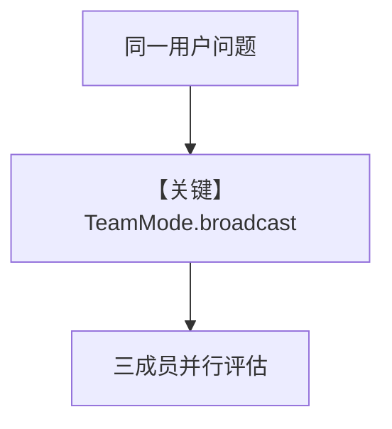

# broadcast_mode.py — 实现原理分析

<!-- cookbook-py-source:start -->
## 完整源码

```python
"""
Broadcast Mode
=============================

Demonstrates delegating the same task to all members using TeamMode.broadcast.
"""

from agno.agent import Agent
from agno.models.openai import OpenAIResponses
from agno.team import Team, TeamMode

# ---------------------------------------------------------------------------
# Create Members
# ---------------------------------------------------------------------------
product_manager = Agent(
    name="Product Manager",
    model=OpenAIResponses(id="gpt-5.2"),
    role="Assess user and business impact",
)

engineer = Agent(
    name="Engineer",
    model=OpenAIResponses(id="gpt-5.2"),
    role="Assess technical feasibility and risks",
)

designer = Agent(
    name="Designer",
    model=OpenAIResponses(id="gpt-5.2"),
    role="Assess UX implications and usability",
)

# ---------------------------------------------------------------------------
# Create Team
# ---------------------------------------------------------------------------
broadcast_team = Team(
    name="Broadcast Review Team",
    members=[product_manager, engineer, designer],
    model=OpenAIResponses(id="gpt-5.2"),
    mode=TeamMode.broadcast,
    instructions=[
        "Each member must independently evaluate the same request.",
        "Provide concise recommendations from your specialist perspective.",
        "Highlight tradeoffs and open risks clearly.",
    ],
    markdown=True,
    show_members_responses=True,
)

# ---------------------------------------------------------------------------
# Run Team
# ---------------------------------------------------------------------------
if __name__ == "__main__":
    broadcast_team.print_response(
        "Should we ship a beta autopilot feature next month? Provide your recommendation and risks.",
        stream=True,
    )
```

<!-- cookbook-py-source:end -->

> 源文件：`cookbook/03_teams/01_quickstart/broadcast_mode.py`

## 概述

本示例展示 **TeamMode.broadcast** 的最小用例：产品/工程/设计三名成员对 **同一** 业务问题独立评估，`instructions` 要求各自视角与风险；`show_members_responses=True`。

**核心配置一览：**

| 配置项 | 值 |
|--------|-----|
| `mode` | `TeamMode.broadcast` |
| `members` | 3 个 Agent |
| `markdown` | `True` |

## System Prompt 组装

```text
Each member must independently evaluate the same request.
Provide concise recommendations from your specialist perspective.
Highlight tradeoffs and open risks clearly.

Use markdown to format your answers.
```

## Mermaid 流程图


```mermaid
flowchart TD
    Q["同一用户问题"] --> B["【关键】TeamMode.broadcast"]
    B --> T["三成员并行评估"]
```

- **【关键】TeamMode.broadcast**：一题多视角。

## 关键源码文件索引

| 文件 | 作用 |
|------|------|
| `agno/team/team.py` | `mode`、`run` L732+ |
