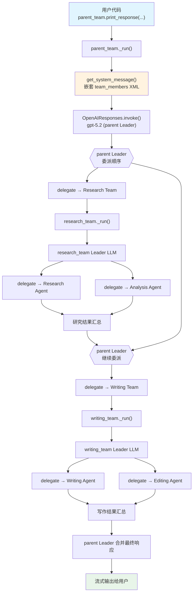

# nested_teams.py — 实现原理分析

> 源文件：`cookbook/03_teams/01_quickstart/nested_teams.py`

## 概述

本示例展示 Agno 的**嵌套 Team（Nested Teams）**机制：将 Team 作为另一个 Team 的成员，形成三层层级结构——顶层 `parent_team` 协调 `research_team` 和 `writing_team`，每个子 Team 内部再协调各自的 Agent 成员。这实现了大型任务的分层分工。

**核心配置一览：**

| 配置项 | parent_team | research_team | writing_team |
|--------|-------------|---------------|--------------|
| `name` | `"Program Team"` | `"Research Team"` | `"Writing Team"` |
| `model` | `OpenAIResponses(id="gpt-5.2")` | `OpenAIResponses(id="gpt-5.2")` | `OpenAIResponses(id="gpt-5.2")` |
| `members` | `[research_team, writing_team]` | `[research_agent, analysis_agent]` | `[writing_agent, editing_agent]` |
| `mode` | `None`（coordinate） | `None`（coordinate） | `None`（coordinate） |
| `instructions` | 2 条协调指令 | 2 条研究指令 | 2 条写作指令 |
| `markdown` | `True` | `False` | `False` |
| `show_members_responses` | `True` | `False` | `False` |

| 成员 Agent | `name` | `model` | `role` |
|------------|--------|---------|--------|
| research_agent | `"Research Agent"` | `OpenAIResponses(id="gpt-5.2")` | `"Gather references and source material"` |
| analysis_agent | `"Analysis Agent"` | `OpenAIResponses(id="gpt-5.2")` | `"Extract key findings and implications"` |
| writing_agent | `"Writing Agent"` | `OpenAIResponses(id="gpt-5.2")` | `"Draft polished narrative output"` |
| editing_agent | `"Editing Agent"` | `OpenAIResponses(id="gpt-5.2")` | `"Improve clarity and structure"` |

## 架构分层

```
用户代码层                    agno.team 层（三层嵌套）
┌────────────────────┐       ┌──────────────────────────────────────────────┐
│ nested_teams.py    │       │ parent_team (Program Team)                   │
│                    │       │  ├─ Leader LLM (gpt-5.2)                     │
│ parent_team        │──────>│  │    system_prompt: Team + 2 子 Team 成员   │
│   .print_response( │       │  ├─ delegate → research_team                 │
│     "...",         │       │  │    ┌─────────────────────────────────┐     │
│     stream=True,   │       │  │    │ research_team (Research Team)   │     │
│   )                │       │  │    │  Leader LLM (gpt-5.2)          │     │
└────────────────────┘       │  │    │  → delegate → research_agent   │     │
                             │  │    │  → delegate → analysis_agent   │     │
                             │  │    └─────────────────────────────────┘     │
                             │  └─ delegate → writing_team                   │
                             │       ┌─────────────────────────────────┐     │
                             │       │ writing_team (Writing Team)     │     │
                             │       │  Leader LLM (gpt-5.2)          │     │
                             │       │  → delegate → writing_agent    │     │
                             │       │  → delegate → editing_agent    │     │
                             │       └─────────────────────────────────┘     │
                             └──────────────────────────────────────────────┘
```

## 核心组件解析

### 嵌套 Team 的成员 XML 渲染

当子 Team 作为父 Team 的成员时，`get_members_system_message_content()` 会递归渲染子 Team 的成员信息（`team/_messages.py` L90-96）：

```python
# team/_messages.py L90-96 — 子 Team 成员渲染（递归）
if isinstance(member, Team):
    content += f'{pad}<member id="{member_id}" name="{member.name}" type="team">\n'
    if member.description is not None:
        content += f"{pad}  Description: {member.description}\n"
    if member.members is not None:
        # 递归渲染子 Team 的成员
        content += member.get_members_system_message_content(indent=indent + 2, run_context=run_context)
    content += f"{pad}</member>\n"
```

父 Team 的 system prompt 中会看到嵌套的 `<member type="team">` XML 块，告知 Leader 子 Team 的存在及其成员结构。

### 委派路径

父 Team Leader 委派给子 Team 时，使用的仍是 `delegate_task_to_member` 工具，但目标 `member_id` 是子 Team 的 ID（如 `"Research Team"`）。子 Team 的 Leader 接收到任务后，再用自己的 `delegate_task_to_member` 工具委派给下级 Agent。

### show_members_responses 只在顶层设置

只有 `parent_team` 设置了 `show_members_responses=True`，这意味着：
- 父 Team 的两个子 Team 响应会被打印
- 子 Team 内部 Agent 的响应不会被打印（子 Team 未设置此标志）

## System Prompt 组装（parent_team Leader）

| 序号 | 组成部分 | 本文件中的值/来源 | 是否生效 |
|------|---------|-----------------|---------|
| 1 | `system_message`（自定义） | `None` | 否 |
| 2.1 | 开场词 + `<team_members>` XML（含嵌套） | research_team / writing_team + 各自成员 | 是 |
| 2.1 | `<how_to_respond>` coordinate 模式 | 默认 coordinate | 是 |
| 2.2 | `description` | `None` | 否 |
| 2.2 | `role` | `None` | 否 |
| 2.2 | `instructions` 拼接 | 2 条协调指令 | 是 |
| - | `markdown` | `True` → "Use markdown..." | 是 |
| - | model system message | OpenAIResponses 内置 | 是 |

### 最终 System Prompt（parent_team Leader）

```text
You coordinate a team of specialized AI agents to fulfill the user's request. ...

<team_members>
<member id="Research Team" name="Research Team" type="team">
  <member id="Research Agent" name="Research Agent">
    Role: Gather references and source material
  </member>
  <member id="Analysis Agent" name="Analysis Agent">
    Role: Extract key findings and implications
  </member>
</member>
<member id="Writing Team" name="Writing Team" type="team">
  <member id="Writing Agent" name="Writing Agent">
    Role: Draft polished narrative output
  </member>
  <member id="Editing Agent" name="Editing Agent">
    Role: Improve clarity and structure
  </member>
</member>
</team_members>

<how_to_respond>
You operate in coordinate mode. ...
</how_to_respond>

- Coordinate nested teams to deliver a single coherent response.
- Ask Research Team for evidence first, then Writing Team for synthesis.

<additional_information>
- Use markdown to format your answers.
</additional_information>
```

## 完整 API 请求

**parent_team Leader 初始调用：**

```python
client.responses.create(
    model="gpt-5.2",
    input=[
        {"role": "developer", "content": "You coordinate a team...<team_members>\n<member id=\"Research Team\" type=\"team\">\n  ...\n</member>\n..."},
        {"role": "user", "content": "Prepare a one-page brief on adopting AI coding assistants in a startup engineering team."}
    ],
    tools=[{"type": "function", "name": "delegate_task_to_member", ...}],
    stream=True,
    stream_options={"include_usage": True}
)
```

**parent_team 委派 research_team，research_team Leader 再委派内部 Agent：**

```python
# research_team Leader 接收任务（作为 Agent 被调用）
client.responses.create(
    model="gpt-5.2",
    input=[
        {"role": "developer", "content": "You coordinate a team...<team_members>\n<member id=\"Research Agent\">...</member>\n<member id=\"Analysis Agent\">...</member>..."},
        {"role": "user", "content": "<task>\nResearch AI coding assistants adoption in startups...\n</task>"}
    ],
    tools=[{"type": "function", "name": "delegate_task_to_member", ...}],
    stream=True
)

# research_team 委派 research_agent
client.responses.create(
    model="gpt-5.2",
    input=[
        {"role": "developer", "content": "<your_role>\nGather references and source material\n</your_role>"},
        {"role": "user", "content": "<task>\n...\n</task>"}
    ],
    stream=True
)
```

## Mermaid 流程图



## 关键源码文件索引

| 文件 | 关键函数/类 | 作用 |
|------|------------|------|
| `agno/team/team.py` | `Team` L70 | Team 类，`members` 支持嵌套 Team |
| `agno/team/_messages.py` | `get_members_system_message_content()` L76 | 递归渲染嵌套子 Team 成员 XML |
| `agno/team/_messages.py` | L90-96 | `isinstance(member, Team)` 分支，嵌套渲染 |
| `agno/team/_messages.py` | `get_system_message()` L328 | 构建父 Team Leader system prompt |
| `agno/team/_default_tools.py` | `delegate_task_to_member()` | 委派工具（父→子 Team 或 子 Team→Agent） |
| `agno/team/mode.py` | `TeamMode.coordinate` | 默认协调模式枚举 |
