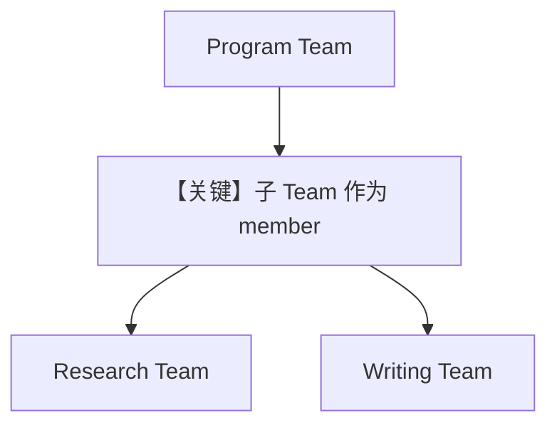

# nested_teams.py — 实现原理分析

> 源文件：`cookbook/03_teams/01_quickstart/nested_teams.py`

## 概述

本示例展示 Agno 的 **嵌套 Team（members 含 Team）** 机制：`parent_team` 的成员为 `research_team` 与 `writing_team` 两个子团队；`team.py` L76：`members` 可为 `Agent` 或嵌套 `Team`；队长按 `instructions` 先证据后成文。

**核心配置一览：**

| 配置项 | 值 |
|--------|-----|
| `members` | `[research_team, writing_team]` |
| `instructions` | 协调嵌套团队顺序 |

## 核心组件解析

子团队各自有 `model` 与 `instructions`；父团队统一协调。

### 运行机制与因果链

队长可先把任务派给 Research Team，再将结果交给 Writing Team（由 LLM 路由与对话结构实现）。

## System Prompt 组装

父团队：

```text
Coordinate nested teams to deliver a single coherent response.
Ask Research Team for evidence first, then Writing Team for synthesis.

Use markdown to format your answers.
```

## Mermaid 流程图


```mermaid
flowchart TD
    P["Program Team"] --> R["【关键】子 Team 作为 member"]
    R --> A["Research Team"]
    R --> W["Writing Team"]
```

- **【关键】子 Team 作为 member**：层级委托。

## 关键源码文件索引

| 文件 | 作用 |
|------|------|
| `agno/team/team.py` | `members` 类型 L76 |
