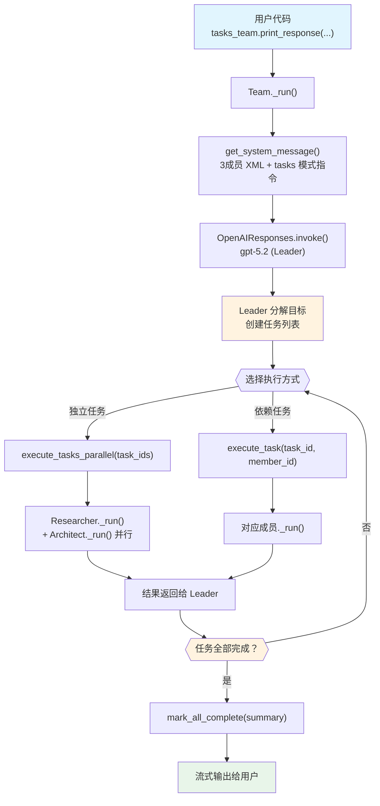

# task_mode.py — 实现原理分析

> 源文件：`cookbook/03_teams/01_quickstart/task_mode.py`

## 概述

本示例展示 Agno 的 **`TeamMode.tasks` 自主任务模式**机制：Team Leader 将用户目标**分解为离散任务**，通过专属工具（`execute_task`、`execute_tasks_parallel`、`mark_all_complete` 等）自主调度和执行，直到所有任务完成。这是最自主的 Team 执行模式，适合需要任务规划和跟踪的复杂目标。

**核心配置一览：**

| 配置项 | 值 | 说明 |
|--------|------|------|
| `name` | `"Task Execution Team"` | Team 名称 |
| `model` | `OpenAIResponses(id="gpt-5.2")` | Leader 使用 Responses API |
| `mode` | `TeamMode.tasks` | 自主任务分解执行模式 |
| `members` | `[researcher, architect, writer]` | 三名专家成员 |
| `instructions` | `[str, str, str, str]` | 4 条任务管理指令 |
| `markdown` | `True` | 启用 markdown 格式化 |
| `show_members_responses` | `True` | 显示成员 Agent 的响应 |
| `max_iterations` | `10`（默认） | 任务循环最大迭代次数 |
| `description` | `None` | 未设置 |
| `db` | `None` | 未设置 |

| 成员 | `name` | `model` | `role` |
|------|--------|---------|--------|
| researcher | `"Researcher"` | `OpenAIResponses(id="gpt-5.2")` | `"Research requirements and gather references"` |
| architect | `"Architect"` | `OpenAIResponses(id="gpt-5.2")` | `"Design execution plans and task dependencies"` |
| writer | `"Writer"` | `OpenAIResponses(id="gpt-5.2")` | `"Write concise delivery summaries"` |

## 架构分层

```
用户代码层                       agno.team 层（tasks 自主任务循环）
┌────────────────────────┐      ┌────────────────────────────────────────────┐
│ task_mode.py           │      │ Team._run()                                │
│                        │      │  ├─ get_system_message()                   │
│ tasks_team             │─────>│  │    tasks 模式 <how_to_respond>          │
│   .print_response(     │      │  │    instructions 拼接（4条）              │
│     "Plan a launch...",│      │  │                                         │
│     stream=True,       │      │  ├─ 任务循环（max_iterations=10）           │
│   )                    │      │  │    Leader LLM: 分解目标 → 创建任务列表   │
└────────────────────────┘      │  │    → execute_task(task_id, member_id)   │
                                │  │    → execute_tasks_parallel(task_ids)   │
                                │  │    → add_task_note(task_id, note)       │
                                │  │    → list_tasks()                       │
                                │  │    → mark_all_complete(summary)         │
                                └────────────────────────────────────────────┘
                                                  │
                                                  ▼
                                    ┌──────────────────────────┐
                                    │ OpenAIResponses (Leader)  │
                                    │ gpt-5.2                   │
                                    └──────────────────────────┘
                                          │           │          │
                                          ▼           ▼          ▼
                              ┌──────────────┐ ┌──────────┐ ┌──────────┐
                              │  Researcher  │ │Architect │ │  Writer  │
                              │  gpt-5.2    │ │ gpt-5.2  │ │ gpt-5.2  │
                              └──────────────┘ └──────────┘ └──────────┘
```

## 核心组件解析

### TeamMode.tasks 执行模式

`TeamMode.tasks` 在 `_get_mode_instructions()` 中注入专属的任务管理工作流（`team/_messages.py` L127-147）：

```python
# team/_messages.py L127-147 — tasks 模式指令
if team.mode == TeamMode.tasks:
    content += (
        "You operate in autonomous task mode. Decompose the user's goal into discrete tasks, "
        "execute them by delegating to team members, and deliver the final result.\n\n"
        "Planning:\n"
        "- Break the goal into tasks with clear, actionable titles and self-contained descriptions. ...\n"
        "- Assign each task to the member whose role and tools are best suited.\n"
        "- Set `depends_on` when a task requires another task's output. ...\n\n"
        "Execution:\n"
        "- Use `execute_task` for sequential or dependent tasks.\n"
        "- Use `execute_tasks_parallel` for groups of independent tasks to maximize throughput.\n"
        ...
        "- When all tasks are done, call `mark_all_complete` with a summary of the outcome.\n"
    )
```

### tasks 模式专属工具

tasks 模式下 Team 注册了一套专属工具，Leader 通过这些工具管理任务生命周期（`team/_task_tools.py`）：

| 工具 | 行号 | 说明 |
|------|------|------|
| `list_tasks()` | L152 | 查看当前所有任务及状态 |
| `add_task_note(task_id, note)` | L163 | 为任务添加备注/观察 |
| `mark_all_complete(summary)` | L182 | 标记所有任务完成，结束循环 |
| `execute_task(task_id, member_id)` | L284 | 顺序执行单个任务（委派给指定成员） |
| `execute_tasks_parallel(task_ids)` | L548 | 并行执行多个独立任务 |

### 任务循环（Agentic Loop）

tasks 模式使 Leader 进入自主循环，每次循环 Leader 决定下一步操作：

```
1. Leader 分析用户目标
2. 调用 execute_task / execute_tasks_parallel 委派任务给成员
3. 成员完成任务，结果返回给 Leader
4. Leader 检查结果，决定：
   - 继续执行更多任务
   - 调用 list_tasks() 检查进度
   - 调用 mark_all_complete() 结束循环
5. 循环直到 mark_all_complete() 被调用（或达到 max_iterations）
```

### max_iterations 防护

`max_iterations=10`（默认值）防止无限循环。每次工具调用算一次迭代，超过限制后 Leader 被强制结束。

## System Prompt 组装（Team Leader）

| 序号 | 组成部分 | 本文件中的值/来源 | 是否生效 |
|------|---------|-----------------|---------|
| 1 | `system_message`（自定义） | `None` | 否 |
| 2.1 | 开场词 + `<team_members>` XML（3个） | researcher / architect / writer | 是 |
| 2.1 | `<how_to_respond>` tasks 模式 | `mode=TeamMode.tasks` | 是 |
| 2.2 | `description` | `None` | 否 |
| 2.2 | `role` | `None` | 否 |
| 2.2 | `instructions` 拼接 | 4 条任务管理指令 | 是 |
| - | `markdown` | `True` → "Use markdown..." | 是 |
| - | model system message | OpenAIResponses 内置 | 是 |
| - | `add_session_state_to_context` | `False` | 否 |

### 最终 System Prompt（Leader）

```text
You coordinate a team of specialized AI agents to fulfill the user's request. ...

<team_members>
<member id="Researcher" name="Researcher">
  Role: Research requirements and gather references
</member>
<member id="Architect" name="Architect">
  Role: Design execution plans and task dependencies
</member>
<member id="Writer" name="Writer">
  Role: Write concise delivery summaries
</member>
</team_members>

<how_to_respond>
You operate in autonomous task mode. Decompose the user's goal into discrete tasks, execute them by delegating to team members, and deliver the final result.

Planning:
- Break the goal into tasks with clear, actionable titles and self-contained descriptions. ...
- Assign each task to the member whose role and tools are best suited.
- Set `depends_on` when a task requires another task's output. ...

Execution:
- Use `execute_task` for sequential or dependent tasks.
- Use `execute_tasks_parallel` for groups of independent tasks to maximize throughput.
- Review each result before proceeding. ...

Completion:
- When all tasks are done and results are satisfactory, call `mark_all_complete` with a summary of the outcome.
- Use `list_tasks` to check progress at any point, and `add_task_note` to record observations.
...
</how_to_respond>

- Break goals into clear tasks with dependencies before starting.
- Assign each task to the most appropriate member.
- Track task completion and surface blockers explicitly.
- Provide a final consolidated summary with completed tasks.

<additional_information>
- Use markdown to format your answers.
</additional_information>
```

## 完整 API 请求

**Leader 初始调用（任务模式，注册 5 个任务工具）：**

```python
client.responses.create(
    model="gpt-5.2",
    input=[
        {"role": "developer", "content": "You coordinate a team...<team_members>...<how_to_respond>autonomous task mode...</how_to_respond>..."},
        {"role": "user", "content": "Plan a launch checklist for a new AI feature, including engineering, QA, and rollout tasks."}
    ],
    tools=[
        # tasks 模式专属工具组
        {"type": "function", "name": "list_tasks", "description": "List all tasks and their status.", "parameters": {}},
        {"type": "function", "name": "add_task_note", "description": "Add a note to a task.", "parameters": {"type": "object", "properties": {"task_id": {"type": "string"}, "note": {"type": "string"}}}},
        {"type": "function", "name": "mark_all_complete", "description": "Mark all tasks as complete.", "parameters": {"type": "object", "properties": {"summary": {"type": "string"}}}},
        {"type": "function", "name": "execute_task", "description": "Execute a task by delegating to a member.", "parameters": {"type": "object", "properties": {"task_id": {"type": "string"}, "member_id": {"type": "string"}}}},
        {"type": "function", "name": "execute_tasks_parallel", "description": "Execute multiple tasks in parallel.", "parameters": {"type": "object", "properties": {"task_ids": {"type": "array", "items": {"type": "string"}}}}}
    ],
    stream=True,
    stream_options={"include_usage": True}
)
```

**第二轮（execute_task 委派 Researcher）：**

```python
# Leader 调用 execute_task(task_id="task_1", member_id="Researcher")
# Agno 内部：Researcher Agent 接收任务
client.responses.create(
    model="gpt-5.2",
    input=[
        {"role": "developer", "content": "<your_role>\nResearch requirements and gather references\n</your_role>"},
        {"role": "user", "content": "<task>\nResearch AI feature launch requirements and best practices...\n</task>"}
    ],
    stream=True
)
```

## Mermaid 流程图



## 关键源码文件索引

| 文件 | 关键函数/类 | 作用 |
|------|------------|------|
| `agno/team/mode.py` | `TeamMode.tasks` | 自主任务模式枚举 |
| `agno/team/_messages.py` | `_get_mode_instructions()` L127-147 | 生成 tasks 模式 `<how_to_respond>` |
| `agno/team/_task_tools.py` | `list_tasks()` L152 | 查看任务列表工具 |
| `agno/team/_task_tools.py` | `mark_all_complete()` L182 | 标记完成工具 |
| `agno/team/_task_tools.py` | `execute_task()` L284 | 顺序执行单任务工具 |
| `agno/team/_task_tools.py` | `execute_tasks_parallel()` L548 | 并行执行多任务工具 |
| `agno/team/team.py` | `max_iterations` L107 | 任务循环最大迭代次数 |
