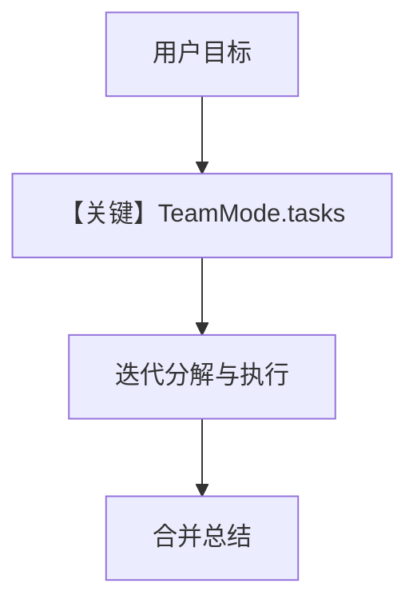

# task_mode.py — 实现原理分析

<!-- cookbook-py-source:start -->
## 完整源码

```python
"""
Task Mode
=============================

Demonstrates autonomous task decomposition and execution using TeamMode.tasks.
"""

from agno.agent import Agent
from agno.models.openai import OpenAIResponses
from agno.team import Team, TeamMode

# ---------------------------------------------------------------------------
# Create Members
# ---------------------------------------------------------------------------
researcher = Agent(
    name="Researcher",
    model=OpenAIResponses(id="gpt-5.2"),
    role="Research requirements and gather references",
)

architect = Agent(
    name="Architect",
    model=OpenAIResponses(id="gpt-5.2"),
    role="Design execution plans and task dependencies",
)

writer = Agent(
    name="Writer",
    model=OpenAIResponses(id="gpt-5.2"),
    role="Write concise delivery summaries",
)

# ---------------------------------------------------------------------------
# Create Team
# ---------------------------------------------------------------------------
tasks_team = Team(
    name="Task Execution Team",
    members=[researcher, architect, writer],
    model=OpenAIResponses(id="gpt-5.2"),
    mode=TeamMode.tasks,
    instructions=[
        "Break goals into clear tasks with dependencies before starting.",
        "Assign each task to the most appropriate member.",
        "Track task completion and surface blockers explicitly.",
        "Provide a final consolidated summary with completed tasks.",
    ],
    markdown=True,
    show_members_responses=True,
)

# ---------------------------------------------------------------------------
# Run Team
# ---------------------------------------------------------------------------
if __name__ == "__main__":
    tasks_team.print_response(
        "Plan a launch checklist for a new AI feature, including engineering, QA, and rollout tasks.",
        stream=True,
    )
```

<!-- cookbook-py-source:end -->

> 源文件：`cookbook/03_teams/01_quickstart/task_mode.py`

## 概述

本示例展示 **TeamMode.tasks**：队长将目标拆解为带依赖的任务并分配给 `Researcher` / `Architect` / `Writer`；`team.py` L106–108：`max_iterations` 限制自主任务循环轮数（默认 10）。

**核心配置一览：**

| 配置项 | 值 |
|--------|-----|
| `mode` | `TeamMode.tasks` |
| `instructions` | 任务分解、分配、汇总 |

## System Prompt 组装

```text
Break goals into clear tasks with dependencies before starting.
Assign each task to the most appropriate member.
Track task completion and surface blockers explicitly.
Provide a final consolidated summary with completed tasks.

Use markdown to format your answers.
```

## Mermaid 流程图


```mermaid
flowchart TD
    G["用户目标"] --> T["【关键】TeamMode.tasks"]
    T --> L["迭代分解与执行"]
    L --> S["合并总结"]
```

- **【关键】TeamMode.tasks**：自主任务图执行。

## 关键源码文件索引

| 文件 | 作用 |
|------|------|
| `agno/team/team.py` | `mode` L97-99；`max_iterations` L106-108 |
