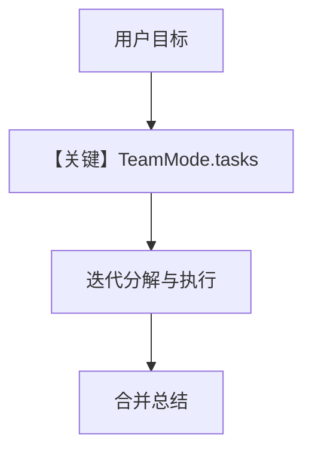

# task_mode.py — 实现原理分析

> 源文件：`cookbook/03_teams/01_quickstart/task_mode.py`

## 概述

本示例展示 **TeamMode.tasks**：队长将目标拆解为带依赖的任务并分配给 `Researcher` / `Architect` / `Writer`；`team.py` L106–108：`max_iterations` 限制自主任务循环轮数（默认 10）。

**核心配置一览：**

| 配置项 | 值 |
|--------|-----|
| `mode` | `TeamMode.tasks` |
| `instructions` | 任务分解、分配、汇总 |

## System Prompt 组装

```text
Break goals into clear tasks with dependencies before starting.
Assign each task to the most appropriate member.
Track task completion and surface blockers explicitly.
Provide a final consolidated summary with completed tasks.

Use markdown to format your answers.
```

## Mermaid 流程图


```mermaid
flowchart TD
    G["用户目标"] --> T["【关键】TeamMode.tasks"]
    T --> L["迭代分解与执行"]
    L --> S["合并总结"]
```

- **【关键】TeamMode.tasks**：自主任务图执行。

## 关键源码文件索引

| 文件 | 作用 |
|------|------|
| `agno/team/team.py` | `mode` L97-99；`max_iterations` L106-108 |
