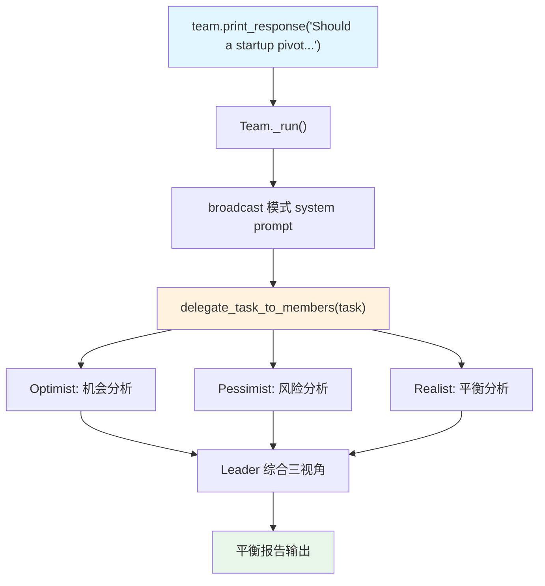

# 01_basic.py — 实现原理分析

> 源文件：`cookbook/03_teams/02_modes/broadcast/01_basic.py`

## 概述

本示例展示 Agno 的 **broadcast 模式多视角分析**：三名成员（Optimist/Pessimist/Realist）同时接收相同问题，从各自角度独立评估，Leader 综合三方观点形成平衡报告。这是 broadcast 模式的核心用途——对同一问题获取多元视角。

**核心配置一览：**

| 配置项 | 值 | 说明 |
|--------|------|------|
| `name` | `"Multi-Perspective Team"` | Team 名称 |
| `model` | `OpenAIResponses(id="gpt-5.2")` | Leader |
| `mode` | `TeamMode.broadcast` | 广播所有成员 |
| `members` | `[optimist, pessimist, realist]` | 三个视角 Agent |
| `instructions` | `[str, str, str, str]` | 合成指令 |
| `show_members_responses` | `True` | 显示成员响应 |
| `markdown` | `True` | markdown 格式 |

| 成员 | `role` | 特点 |
|------|--------|------|
| Optimist | 机会与正面结果 | 积极派，关注增长潜力 |
| Pessimist | 风险与潜在劣势 | 谨慎派，建设性指出问题 |
| Realist | 平衡务实分析 | 中立派，基于证据 |

## 核心组件解析

### broadcast 模式的并行执行

三名成员同时收到相同的任务（via `delegate_task_to_members`），并行独立响应。Leader 不预先知道各成员的答案，只在收到所有响应后才综合分析。

### System Prompt（Leader 节选）

```text
You coordinate a team...
<team_members>
<member id="Optimist" ...>Role: Focuses on opportunities...</member>
<member id="Pessimist" ...>Role: Focuses on risks...</member>
<member id="Realist" ...>Role: Provides balanced, pragmatic analysis</member>
</team_members>
<how_to_respond>
You operate in broadcast mode. Call `delegate_task_to_members` exactly once...
After receiving member responses: Compare perspectives, synthesize into unified answer...
</how_to_respond>
- You lead a multi-perspective analysis team.
- All members receive the same question and respond independently.
- Synthesize their viewpoints into a balanced summary...
<additional_information>- Use markdown to format your answers.</additional_information>
```

## Mermaid 流程图



## 关键源码文件索引

| 文件 | 关键函数/类 | 作用 |
|------|------------|------|
| `agno/team/mode.py` | `TeamMode.broadcast` | 广播模式枚举 |
| `agno/team/_messages.py` | `_get_mode_instructions()` L160 | broadcast 指令生成 |
| `agno/team/_default_tools.py` | `delegate_task_to_members()` L750 | 广播工具 |
