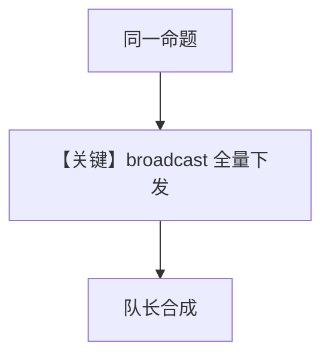

# 01_basic.py — 实现原理分析

> 源文件：`cookbook/03_teams/02_modes/broadcast/01_basic.py`

## 概述

本示例展示 **TeamMode.broadcast**：队长向 **全部** 成员发送同一问题，再综合乐观/悲观/现实三视角；`agno.team.mode.TeamMode` 与 `Team` 同 `01_quickstart/broadcast_mode` 一致，属「多视角」模板。

**核心配置一览：**

| 配置项 | 值 |
|--------|-----|
| `mode` | `TeamMode.broadcast` |
| `members` | optimist, pessimist, realist |
| `instructions` | 队长合成多视角 |

## System Prompt 组装（队长）

```text
You lead a multi-perspective analysis team.
All members receive the same question and respond independently.
Synthesize their viewpoints into a balanced summary that captures
the key opportunities, risks, and most likely outcomes.

Use markdown to format your answers.
```

## Mermaid 流程图


```mermaid
flowchart TD
    Q["同一命题"] --> B["【关键】broadcast 全量下发"]
    B --> S["队长合成"]
```

- **【关键】broadcast 全量下发**：三成员独立答题。

## 关键源码文件索引

| 文件 | 作用 |
|------|------|
| `agno/team/mode.py` | `TeamMode.broadcast` |
| `agno/team/team.py` | `Team` L71；`run` L732+ |
| `agno/team/_messages.py` | `get_system_message()` L328+ |
