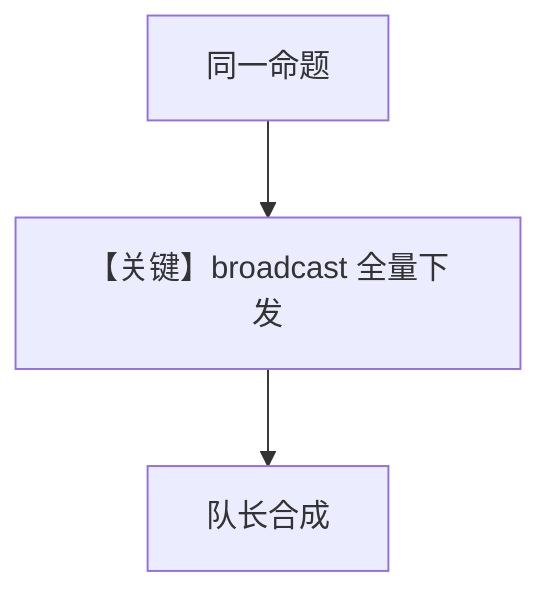

# 01_basic.py — 实现原理分析

<!-- cookbook-py-source:start -->
## 完整源码

```python
"""
Basic Broadcast Mode Example

Demonstrates `mode=broadcast` where the team leader sends the same task
to all member agents simultaneously, then synthesizes their responses
into a unified answer.

This is ideal for getting multiple perspectives on a single question.

"""

from agno.agent import Agent
from agno.models.openai import OpenAIResponses
from agno.team.mode import TeamMode
from agno.team.team import Team

# ---------------------------------------------------------------------------
# Create Members
# ---------------------------------------------------------------------------

optimist = Agent(
    name="Optimist",
    role="Focuses on opportunities and positive outcomes",
    model=OpenAIResponses(id="gpt-5.2"),
    instructions=[
        "You see the bright side of every situation.",
        "Focus on opportunities, growth potential, and positive trends.",
        "Be genuine -- not blindly positive -- but emphasize upsides.",
    ],
)

pessimist = Agent(
    name="Pessimist",
    role="Focuses on risks and potential downsides",
    model=OpenAIResponses(id="gpt-5.2"),
    instructions=[
        "You focus on risks, challenges, and potential pitfalls.",
        "Identify what could go wrong and why caution is warranted.",
        "Be constructive -- raise real concerns, not unfounded fears.",
    ],
)

realist = Agent(
    name="Realist",
    role="Provides balanced, pragmatic analysis",
    model=OpenAIResponses(id="gpt-5.2"),
    instructions=[
        "You provide balanced, evidence-based analysis.",
        "Weigh both opportunities and risks objectively.",
        "Focus on what is most likely to happen based on current data.",
    ],
)

# ---------------------------------------------------------------------------
# Create Team
# ---------------------------------------------------------------------------

team = Team(
    name="Multi-Perspective Team",
    mode=TeamMode.broadcast,
    model=OpenAIResponses(id="gpt-5.2"),
    members=[optimist, pessimist, realist],
    instructions=[
        "You lead a multi-perspective analysis team.",
        "All members receive the same question and respond independently.",
        "Synthesize their viewpoints into a balanced summary that captures",
        "the key opportunities, risks, and most likely outcomes.",
    ],
    show_members_responses=True,
    markdown=True,
)

# ---------------------------------------------------------------------------
# Run Team
# ---------------------------------------------------------------------------

if __name__ == "__main__":
    team.print_response(
        "Should a startup pivot from B2C to B2B in a crowded market?",
        stream=True,
    )
```

<!-- cookbook-py-source:end -->

> 源文件：`cookbook/03_teams/02_modes/broadcast/01_basic.py`

## 概述

本示例展示 **TeamMode.broadcast**：队长向 **全部** 成员发送同一问题，再综合乐观/悲观/现实三视角；`agno.team.mode.TeamMode` 与 `Team` 同 `01_quickstart/broadcast_mode` 一致，属「多视角」模板。

**核心配置一览：**

| 配置项 | 值 |
|--------|-----|
| `mode` | `TeamMode.broadcast` |
| `members` | optimist, pessimist, realist |
| `instructions` | 队长合成多视角 |

## System Prompt 组装（队长）

```text
You lead a multi-perspective analysis team.
All members receive the same question and respond independently.
Synthesize their viewpoints into a balanced summary that captures
the key opportunities, risks, and most likely outcomes.

Use markdown to format your answers.
```

## Mermaid 流程图


```mermaid
flowchart TD
    Q["同一命题"] --> B["【关键】broadcast 全量下发"]
    B --> S["队长合成"]
```

- **【关键】broadcast 全量下发**：三成员独立答题。

## 关键源码文件索引

| 文件 | 作用 |
|------|------|
| `agno/team/mode.py` | `TeamMode.broadcast` |
| `agno/team/team.py` | `Team` L71；`run` L732+ |
| `agno/team/_messages.py` | `get_system_message()` L328+ |
