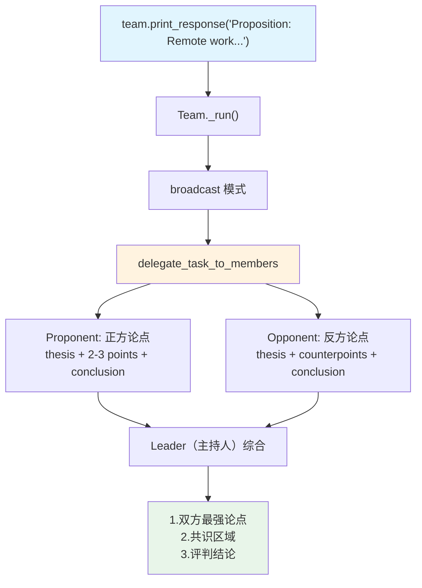

# 02_debate.py — 实现原理分析

> 源文件：`cookbook/03_teams/02_modes/broadcast/02_debate.py`

## 概述

本示例展示 Agno 的 **broadcast 模式辩论场景**：Proponent 和 Opponent 同时接收相同命题，分别从正反两方立论，Leader 作为主持人综合提炼争议要点、共识区域和最终评判。这是 broadcast 模式的经典结构化辩论应用。

**核心配置一览：**

| 配置项 | 值 | 说明 |
|--------|------|------|
| `name` | `"Debate Team"` | Team 名称 |
| `model` | `OpenAIResponses(id="gpt-5.2")` | Leader（主持人） |
| `mode` | `TeamMode.broadcast` | 广播所有成员 |
| `members` | `[proponent, opponent]` | 正反两方 |
| `instructions` | `[str, str, str, str, str]` | 主持人合成指令（含3步） |
| `show_members_responses` | `True` | 显示双方论点 |
| `markdown` | `True` | markdown 格式 |

| 成员 | `name` | `role` | `instructions` |
|------|--------|--------|----------------|
| proponent | `"Proponent"` | 论证支持命题 | 4 条正方立论规则 |
| opponent | `"Opponent"` | 论证反对命题 | 4 条反方立论规则 |

## 核心组件解析

### 辩论流程

1. 用户提交命题（`"Remote work is better than in-office work for software teams."`）
2. Leader 调用 `delegate_task_to_members(task)` → Proponent 和 Opponent 并行立论
3. Leader 综合：① 双方最强论点摘要 ② 共识区域 ③ 哪方论点更具说服力及原因

### System Prompt（Leader 节选）

```text
<how_to_respond>
You operate in broadcast mode. Call `delegate_task_to_members` exactly once...
After receiving member responses:
- Compare perspectives...
- Synthesize into a unified answer that integrates the strongest contributions thematically...
</how_to_respond>
- You are a debate moderator.
- Both debaters receive the same proposition and argue their sides.
- After hearing both sides, provide:
- 1. A summary of the strongest arguments from each side
- 2. Areas of agreement (if any)
- 3. Your assessment of which arguments are most compelling and why
```

## 完整 API 请求（Leader）

```python
client.responses.create(
    model="gpt-5.2",
    input=[
        {"role": "developer", "content": "You coordinate a team...<debate moderator instructions>"},
        {"role": "user", "content": "Proposition: Remote work is better than in-office work for software teams."}
    ],
    tools=[{"type": "function", "name": "delegate_task_to_members", ...}],
    stream=True
)
```

## Mermaid 流程图



## 关键源码文件索引

| 文件 | 关键函数/类 | 作用 |
|------|------------|------|
| `agno/team/_messages.py` | `_get_mode_instructions()` L160-174 | broadcast how_to_respond |
| `agno/team/_default_tools.py` | `delegate_task_to_members()` L750 | 广播工具 |
