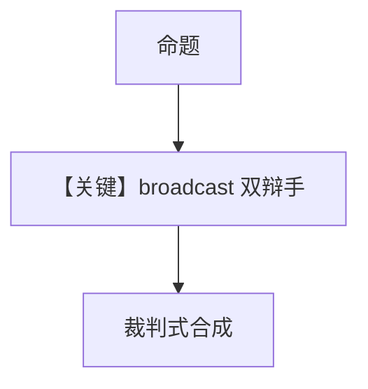

# 02_debate.py — 实现原理分析

> 源文件：`cookbook/03_teams/02_modes/broadcast/02_debate.py`

## 概述

**TeamMode.broadcast** 用于结构化辩论：正反方同一命题独立论证，队长作 **moderator** 总结双方论点、共识与评判。

**核心配置一览：**

| 配置项 | 值 |
|--------|-----|
| `mode` | `TeamMode.broadcast` |
| `members` | Proponent, Opponent |

## System Prompt 组装

```text
You are a debate moderator.
Both debaters receive the same proposition and argue their sides.
After hearing both sides, provide:
1. A summary of the strongest arguments from each side
2. Areas of agreement (if any)
3. Your assessment of which arguments are most compelling and why

Use markdown to format your answers.
```

## Mermaid 流程图


```mermaid
flowchart TD
    P["命题"] --> B["【关键】broadcast 双辩手"]
    B --> M["裁判式合成"]
```

- **【关键】broadcast 双辩手**：同题对抗。

## 关键源码文件索引

| 文件 | 作用 |
|------|------|
| `agno/team/team.py` | `run` → `_run.run_dispatch` L813 |
