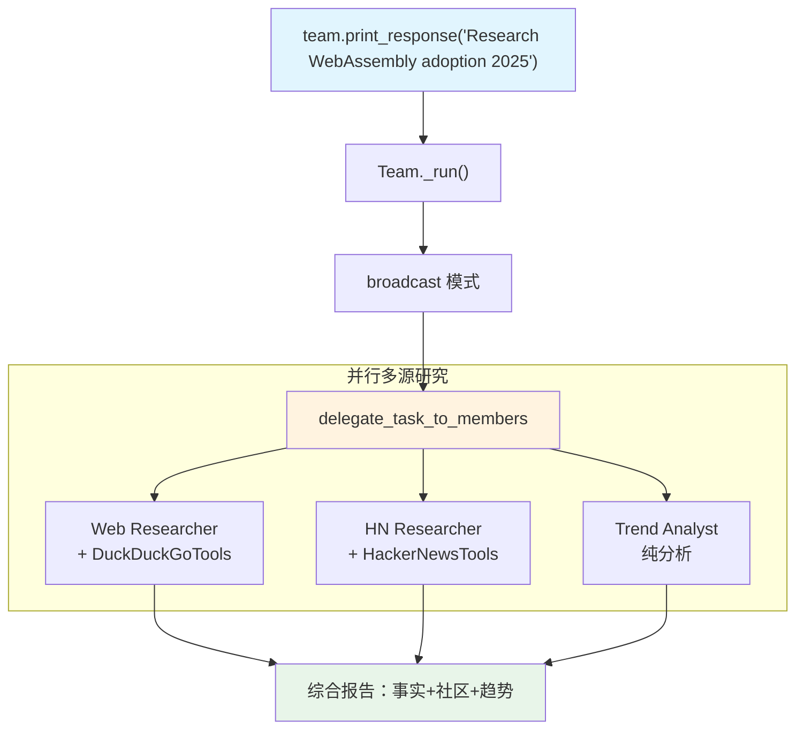

# 03_research_sweep.py — 实现原理分析

> 源文件：`cookbook/03_teams/02_modes/broadcast/03_research_sweep.py`

## 概述

本示例展示 Agno 的 **broadcast 模式并行多源研究**：三名成员各自使用不同工具（DuckDuckGoTools、HackerNewsTools）或不同分析角度（趋势分析），同时对同一主题展开研究。Leader 将三方结果整合为结构化综合报告，覆盖事实、社区讨论和趋势三个维度。

**核心配置一览：**

| 配置项 | 值 | 说明 |
|--------|------|------|
| `name` | `"Research Sweep Team"` | Team 名称 |
| `model` | `OpenAIResponses(id="gpt-5.2")` | Leader |
| `mode` | `TeamMode.broadcast` | 并行广播三成员 |
| `members` | `[web_researcher, hn_researcher, trend_analyst]` | 三个研究角度 |
| `instructions` | `[str, str, str, str, str]` | 5 条综合报告指令（含3步骤） |
| `show_members_responses` | `True` | 显示各源研究结果 |
| `markdown` | `True` | markdown 格式 |

| 成员 | `name` | `tools` | 分析角度 |
|------|--------|---------|---------|
| web_researcher | `"Web Researcher"` | `[DuckDuckGoTools()]` | 通用网络事实 |
| hn_researcher | `"HackerNews Researcher"` | `[HackerNewsTools()]` | 社区讨论 |
| trend_analyst | `"Trend Analyst"` | 无（纯分析） | 宏观趋势 |

## 核心组件解析

### broadcast + 工具的配合

broadcast 模式下，有工具的成员（web_researcher、hn_researcher）会在执行任务时自行调用工具，无工具的成员（trend_analyst）则基于自身知识进行分析。Leader 无需管理工具调用过程，只需综合最终结果。

这是 broadcast 与 coordinate 的关键区别：
- broadcast：Leader 不感知成员内部的工具调用细节
- coordinate：Leader 可以根据工具调用结果调整下一步委派

### 综合报告结构

Leader 的 instructions 规定了综合报告必须包含三个部分：
1. 关键事实和近期进展（来自 Web Researcher）
2. 社区观点和热门讨论（来自 HN Researcher）
3. 总体趋势分析和展望（来自 Trend Analyst）

## System Prompt（Leader 节选）

```text
<team_members>
<member id="Web Researcher" ...>Role: Searches the general web for information</member>
<member id="HackerNews Researcher" ...>Role: Searches Hacker News for community discussions</member>
<member id="Trend Analyst" ...>Role: Analyzes broader trends and implications</member>
</team_members>
<how_to_respond>
...broadcast mode...call `delegate_task_to_members` exactly once...
</how_to_respond>
- You lead a research sweep team.
- All researchers investigate the same topic from different angles.
- Merge their findings into a comprehensive report covering:
- 1. Key facts and recent developments
- 2. Community sentiment and notable discussions
- 3. Overall trend analysis and outlook
```

## Mermaid 流程图



## 关键源码文件索引

| 文件 | 关键函数/类 | 作用 |
|------|------------|------|
| `agno/team/_default_tools.py` | `delegate_task_to_members()` L750 | 广播并行执行 |
| `agno/tools/duckduckgo.py` | `DuckDuckGoTools` | 网络搜索工具 |
| `agno/tools/hackernews.py` | `HackerNewsTools` | HN 搜索工具 |
