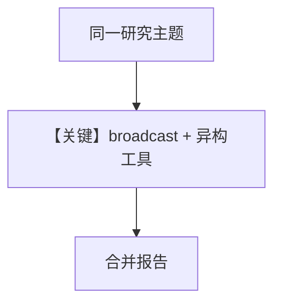

# 03_research_sweep.py — 实现原理分析

<!-- cookbook-py-source:start -->
## 完整源码

```python
"""
Broadcast Mode for Parallel Research Sweep

Demonstrates broadcast mode for gathering information from multiple sources
simultaneously. Each agent specializes in a different source, and the leader
merges findings into a comprehensive report.

"""

from agno.agent import Agent
from agno.models.openai import OpenAIResponses
from agno.team.mode import TeamMode
from agno.team.team import Team
from agno.tools.duckduckgo import DuckDuckGoTools
from agno.tools.hackernews import HackerNewsTools

# ---------------------------------------------------------------------------
# Create Members
# ---------------------------------------------------------------------------

web_researcher = Agent(
    name="Web Researcher",
    role="Searches the general web for information",
    model=OpenAIResponses(id="gpt-5.2"),
    tools=[DuckDuckGoTools()],
    instructions=[
        "Search the web for the given topic.",
        "Focus on recent, authoritative sources.",
        "Provide a concise summary of key findings.",
    ],
)

hn_researcher = Agent(
    name="HackerNews Researcher",
    role="Searches Hacker News for community discussions and stories",
    model=OpenAIResponses(id="gpt-5.2"),
    tools=[HackerNewsTools()],
    instructions=[
        "Search Hacker News for stories and discussions on the topic.",
        "Highlight top-voted stories and notable community opinions.",
        "Provide story titles, scores, and key takeaways.",
    ],
)

trend_analyst = Agent(
    name="Trend Analyst",
    role="Analyzes broader trends and implications from available data",
    model=OpenAIResponses(id="gpt-5.2"),
    instructions=[
        "Analyze the topic from a trends perspective.",
        "Identify patterns: is interest growing, plateauing, or declining?",
        "Consider industry, academic, and public interest angles.",
    ],
)

# ---------------------------------------------------------------------------
# Create Team
# ---------------------------------------------------------------------------

team = Team(
    name="Research Sweep Team",
    mode=TeamMode.broadcast,
    model=OpenAIResponses(id="gpt-5.2"),
    members=[web_researcher, hn_researcher, trend_analyst],
    instructions=[
        "You lead a research sweep team.",
        "All researchers investigate the same topic from different angles.",
        "Merge their findings into a comprehensive report covering:",
        "1. Key facts and recent developments",
        "2. Community sentiment and notable discussions",
        "3. Overall trend analysis and outlook",
    ],
    show_members_responses=True,
    markdown=True,
)

# ---------------------------------------------------------------------------
# Run Team
# ---------------------------------------------------------------------------

if __name__ == "__main__":
    team.print_response(
        "Research the current state of WebAssembly adoption in 2025.",
        stream=True,
    )
```

<!-- cookbook-py-source:end -->

> 源文件：`cookbook/03_teams/02_modes/broadcast/03_research_sweep.py`

## 概述

**TeamMode.broadcast** 用于 **并行调研**：Web（`DuckDuckGoTools`）、HackerNews（`HackerNewsTools`）与趋势分析员 **同时** 接收同一研究主题，队长合并为报告。

**核心配置一览：**

| 配置项 | 值 |
|--------|-----|
| `mode` | `TeamMode.broadcast` |
| `tools` | 成员侧 DuckDuckGo / HackerNews |

## 运行机制与因果链

成员工具调用独立；队长汇总事实、社区观点与趋势。

## Mermaid 流程图


```mermaid
flowchart TD
    T["同一研究主题"] --> B["【关键】broadcast + 异构工具"]
    B --> R["合并报告"]
```

- **【关键】broadcast + 异构工具**：多源并行采集。

## 关键源码文件索引

| 文件 | 作用 |
|------|------|
| `agno/tools/duckduckgo` | `DuckDuckGoTools` |
| `agno/tools/hackernews` | `HackerNewsTools` |
