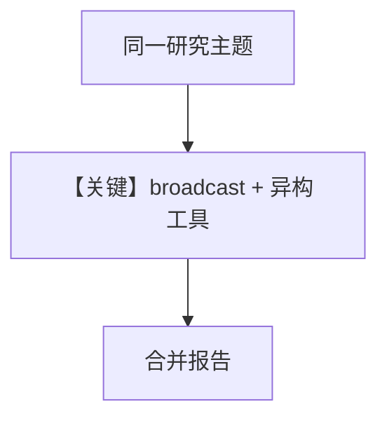

# 03_research_sweep.py — 实现原理分析

> 源文件：`cookbook/03_teams/02_modes/broadcast/03_research_sweep.py`

## 概述

**TeamMode.broadcast** 用于 **并行调研**：Web（`DuckDuckGoTools`）、HackerNews（`HackerNewsTools`）与趋势分析员 **同时** 接收同一研究主题，队长合并为报告。

**核心配置一览：**

| 配置项 | 值 |
|--------|-----|
| `mode` | `TeamMode.broadcast` |
| `tools` | 成员侧 DuckDuckGo / HackerNews |

## 运行机制与因果链

成员工具调用独立；队长汇总事实、社区观点与趋势。

## Mermaid 流程图

```mermaid
flowchart TD
    T["同一研究主题"] --> B["【关键】broadcast + 异构工具"]
    B --> R["合并报告"]
```

- **【关键】broadcast + 异构工具**：多源并行采集。

## 关键源码文件索引

| 文件 | 作用 |
|------|------|
| `agno/tools/duckduckgo` | `DuckDuckGoTools` |
| `agno/tools/hackernews` | `HackerNewsTools` |
