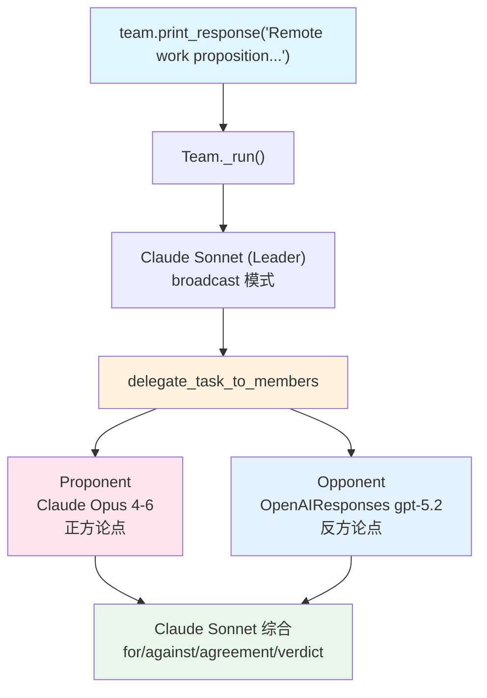

# 04_structured_debate.py — 实现原理分析

> 源文件：`cookbook/03_teams/02_modes/broadcast/04_structured_debate.py`

## 概述

本示例展示 Agno 的 **broadcast 模式混合模型辩论**：Proponent 使用 Claude（claude-opus-4-6），Opponent 使用 OpenAIResponses（gpt-5.2），Team Leader 使用 Claude（claude-sonnet-4-6）。这展示了 Agno 支持**不同模型的成员组合**在同一 Team 中协作，以及 Leader 可与成员使用不同模型的灵活性。

**核心配置一览：**

| 配置项 | 值 | 说明 |
|--------|------|------|
| `name` | `"Structured Debate"` | Team 名称 |
| `model` | `Claude(id="claude-sonnet-4-6")` | Leader 使用 Anthropic Claude |
| `mode` | `TeamMode.broadcast` | 广播模式 |
| `members` | `[proponent, opponent]` | 正反两方，使用不同模型 |
| `instructions` | `["Synthesize responses: ..."]` | 单条综合指令 |
| `show_members_responses` | `True` | 显示辩论内容 |
| `markdown` | `True` | markdown 格式 |

| 成员 | `name` | **`model`** | `role` |
|------|--------|-------------|--------|
| proponent | `"Proponent"` | **`Claude(id="claude-opus-4-6")`** | 论证支持命题 |
| opponent | `"Opponent"` | **`OpenAIResponses(id="gpt-5.2")`** | 论证反对命题 |

## 架构分层

```
用户代码层              agno.team 层              混合模型层
┌─────────────────┐    ┌──────────────────┐      ┌──────────────────────┐
│ 04_structured_  │    │ Team._run()      │      │ Claude Sonnet (Leader)│
│ debate.py       │───>│  broadcast 模式  │─────>│ claude-sonnet-4-6    │
└─────────────────┘    └──────────────────┘      └──────────────────────┘
                                │                           │ delegate_task_to_members
                      ┌─────────┴─────────┐
                      ▼                   ▼
          ┌──────────────────┐  ┌──────────────────────┐
          │ Proponent._run() │  │ Opponent._run()       │
          │ Claude Opus      │  │ OpenAIResponses gpt-5.2│
          │ claude-opus-4-6  │  └──────────────────────┘
          └──────────────────┘
```

## 核心组件解析

### 混合模型支持

Agno 的 Team 架构允许 Leader 和各成员使用完全不同的 LLM 提供商。每个成员 Agent 独立持有自己的 `model` 实例，Leader 通过 `delegate_task_to_member` 委派任务时，成员使用自己的模型响应。这使得可以：
- Leader 用强推理模型（Claude Sonnet）做综合决策
- 某些成员用更专业的模型（Claude Opus）做深度分析
- 其他成员用不同提供商（OpenAI）保持多样性

### Claude（Anthropic）的 API 格式

Claude 使用 Anthropic Messages API，与 OpenAIResponses 的 Responses API 不同：
- 消息格式：`client.messages.create(model=..., messages=[...], system=...)`
- System message 通过独立的 `system` 参数传递（非 messages 列表中的 system 角色）
- 工具格式也略有差异（`input_schema` 而非 `parameters`）

## System Prompt 组装

| 序号 | 组成部分 | 本文件中的值/来源 | 是否生效 |
|------|---------|-----------------|---------|
| 2.1 | 开场词 + `<team_members>` XML | Proponent/Opponent（仅 role） | 是 |
| 2.1 | `<how_to_respond>` broadcast 模式 | `mode=TeamMode.broadcast` | 是 |
| 2.2 | `instructions` | 单条综合指令 | 是 |
| - | `markdown` | `True` | 是 |

## 完整 API 请求（Leader — Claude Sonnet）

```python
# Claude 使用 Anthropic Messages API（非 OpenAI）
client.messages.create(
    model="claude-sonnet-4-6",
    system="You coordinate a team...<broadcast mode instructions>...\nSynthesize responses: highlight points for, against, areas of agreement, and the verdict",
    messages=[
        {"role": "user", "content": "Remote work is better than in-office work for software teams."}
    ],
    tools=[
        {
            "name": "delegate_task_to_members",
            "description": "Delegate a task to all team members simultaneously.",
            "input_schema": {
                "type": "object",
                "properties": {"task": {"type": "string"}},
                "required": ["task"]
            }
        }
    ],
    stream=True
)
```

## Mermaid 流程图



## 关键源码文件索引

| 文件 | 关键函数/类 | 作用 |
|------|------------|------|
| `agno/models/anthropic/` | `Claude` | Anthropic Claude 模型类 |
| `agno/models/openai/responses.py` | `OpenAIResponses` | OpenAI Responses 模型类 |
| `agno/team/_default_tools.py` | `delegate_task_to_members()` L750 | 广播工具 |
| `agno/team/team.py` | `members` L75 | 支持混合模型成员 |
