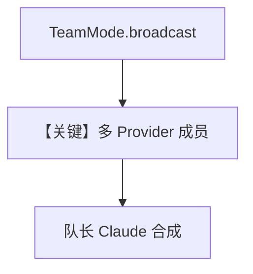

# 04_structured_debate.py — 实现原理分析

<!-- cookbook-py-source:start -->
## 完整源码

```python
"""Broadcast Mode

Same task is sent to every agent in the team. Moderator synthesizes the answer.
"""

from agno.agent import Agent
from agno.models.anthropic import Claude
from agno.models.openai import OpenAIResponses
from agno.team.team import Team, TeamMode

proponent = Agent(
    name="Proponent",
    role="Argue FOR the proposition. Be concise: thesis, 2-3 points, conclusion.",
    model=Claude(id="claude-opus-4-6"),
)

opponent = Agent(
    name="Opponent",
    role="Argue AGAINST the proposition. Be concise: thesis, 2-3 points, conclusion.",
    model=OpenAIResponses(id="gpt-5.2"),
)

team = Team(
    name="Structured Debate",
    mode=TeamMode.broadcast,
    model=Claude(id="claude-sonnet-4-6"),
    members=[proponent, opponent],
    instructions=[
        "Synthesize responses: highlight points for, against, areas of agreement, and the verdict"
    ],
    show_members_responses=True,
    markdown=True,
)

if __name__ == "__main__":
    team.print_response(
        "Remote work is better than in-office work for software teams.", stream=True
    )
```

<!-- cookbook-py-source:end -->

> 源文件：`cookbook/03_teams/02_modes/broadcast/04_structured_debate.py`

## 概述

本示例展示 **跨厂商模型混排**：成员分别为 `Claude`（Anthropic）与 `OpenAIResponses`（OpenAI），队长为 `Claude`；**TeamMode.broadcast** 下仍统一合成。用于说明 Team 只要求成员实现 `Model` 接口，而非单一提供商。

**核心配置一览：**

| 配置项 | 值 |
|--------|-----|
| `proponent.model` | `Claude(id="claude-opus-4-6")` |
| `opponent.model` | `OpenAIResponses(id="gpt-5.2")` |
| `team.model` | `Claude(id="claude-sonnet-4-6")` |

## 完整 API 请求

- **Anthropic**：Messages API（`agno/models/anthropic` 中 `invoke`/`ainvoke`）。
- **OpenAI Responses**：`responses.create`（`agno/models/openai/responses.py`）。

同一 Team run 内会分别调用两套适配器。

## Mermaid 流程图


```mermaid
flowchart TD
    B["TeamMode.broadcast"] --> C["【关键】多 Provider 成员"]
    C --> S["队长 Claude 合成"]
```

- **【关键】多 Provider 成员**：正反方不同厂商模型。

## 关键源码文件索引

| 文件 | 作用 |
|------|------|
| `agno/models/anthropic/claude.py` | Claude 调用 |
| `agno/models/openai/responses.py` | Responses 调用 |
