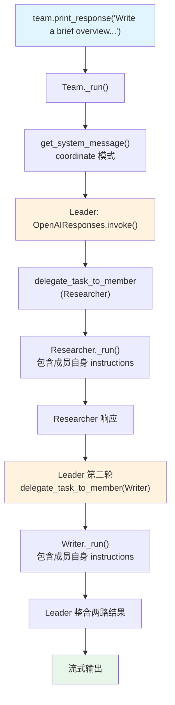

# 01_basic.py — 实现原理分析

> 源文件：`cookbook/03_teams/02_modes/coordinate/01_basic.py`

## 概述

本示例展示 Agno 的 **`TeamMode.coordinate` 协调模式**基础用法：Leader 分析请求后先让 Researcher 收集信息，再让 Writer 将信息转化为精美文章，最后合并两方输出。成员 Agent 各自配有 `instructions` 参数，指导其专业行为。这是 Team 的**默认模式**，适合分工协作类场景。

**核心配置一览：**

| 配置项 | 值 | 说明 |
|--------|------|------|
| `name` | `"Research & Writing Team"` | Team 名称 |
| `model` | `OpenAIResponses(id="gpt-5.2")` | Leader 使用 Responses API |
| `mode` | `TeamMode.coordinate`（显式设置） | 协调模式 |
| `members` | `[researcher, writer]` | 两名专职成员 |
| `instructions` | `[str, str, str, str]` | 4 条协调指令 |
| `show_members_responses` | `True` | 显示成员响应 |
| `markdown` | `True` | 启用 markdown 格式化 |
| `description` | `None` | 未设置 |
| `db` | `None` | 未设置 |

| 成员 | `name` | `model` | `role` | `instructions` |
|------|--------|---------|--------|----------------|
| researcher | `"Researcher"` | `OpenAIResponses(id="gpt-5.2")` | `"Research specialist..."` | 3 条 |
| writer | `"Writer"` | `OpenAIResponses(id="gpt-5.2")` | `"Content writer..."` | 3 条 |

## 架构分层

```
用户代码层                  agno.team 层（coordinate 模式）
┌───────────────────┐      ┌────────────────────────────────────────────┐
│ 01_basic.py       │      │ Team._run()                                │
│                   │      │  ├─ get_system_message()                   │
│ team.print_resp(  │─────>│  │    _build_team_context():               │
│   "Write a brief  │      │  │      开场词 + 2成员XML + coordinate指令  │
│    overview...",  │      │  │    _build_identity_sections():           │
│   stream=True,    │      │  │      4条instructions拼接                │
│ )                 │      │  │    markdown=True → additional_info      │
└───────────────────┘      └────────────────────────────────────────────┘
                                       │
                           ┌───────────┴───────────┐
                           ▼                       ▼
              ┌─────────────────────┐  ┌─────────────────────┐
              │ Researcher._run()   │  │ Writer._run()        │
              │ (3条成员instructions)│  │ (3条成员instructions)│
              │ OpenAIResponses     │  │ OpenAIResponses      │
              └─────────────────────┘  └─────────────────────┘
```

## 核心组件解析

### 成员 Agent 的 `instructions`

成员 Agent 的 `instructions` 仅影响成员自身的 system prompt（`agent/_messages.py` L163-174），不影响 Team Leader 的 system prompt。Leader 通过 `role` 字段了解成员的职责：

| 配置项 | 作用域 |
|--------|--------|
| `Agent.role` | Leader 的 system prompt（`<team_members>` 中） |
| `Agent.instructions` | 成员 Agent 自身的 system prompt |

### coordinate 模式的任务串行

虽然 coordinate 模式可以同时委派多个成员，Leader 的 instructions 明确指定了串行顺序："先让 Researcher 收集事实，再让 Writer 润色"。Leader 会遵从这个顺序依次调用 `delegate_task_to_member`。

## System Prompt 组装（Team Leader）

| 序号 | 组成部分 | 本文件中的值/来源 | 是否生效 |
|------|---------|-----------------|---------|
| 2.1 | 开场词 + `<team_members>` XML（2个） | Researcher/Writer + role | 是 |
| 2.1 | `<how_to_respond>` coordinate 模式 | `mode=TeamMode.coordinate` | 是 |
| 2.2 | `instructions` 拼接 | 4 条协调指令 | 是 |
| - | `markdown` | `True` → "Use markdown..." | 是 |
| - | 其他 | `None`/`False` | 否 |

### 最终 System Prompt（Leader 节选）

```text
You coordinate a team of specialized AI agents...

<team_members>
<member id="Researcher" name="Researcher">
  Role: Research specialist who finds and summarizes information
</member>
<member id="Writer" name="Writer">
  Role: Content writer who crafts polished, engaging text
</member>
</team_members>

<how_to_respond>
You operate in coordinate mode. ...
Delegation:
- Match each sub-task to the member whose role and tools are the best fit. ...
...
</how_to_respond>

- You lead a research and writing team.
- For informational requests, ask the Researcher to gather facts first,
- then ask the Writer to polish the findings into a final piece.
- Synthesize everything into a cohesive response.

<additional_information>
- Use markdown to format your answers.
</additional_information>
```

## 完整 API 请求

**Leader（第一次委派，给 Researcher）：**

```python
client.responses.create(
    model="gpt-5.2",
    input=[
        {"role": "developer", "content": "You coordinate a team..."},
        {"role": "user", "content": "Write a brief overview of how large language models are trained, covering pre-training, fine-tuning, and RLHF."}
    ],
    tools=[{"type": "function", "name": "delegate_task_to_member", ...}],
    stream=True
)
# → delegate_task_to_member(member_id="Researcher", task="Gather facts about LLM training...")
```

**Researcher（成员执行）：**

```python
client.responses.create(
    model="gpt-5.2",
    input=[
        {"role": "developer", "content": "<your_role>Research specialist who finds and summarizes information</your_role>\n- You are a research specialist.\n- Provide clear, factual summaries on any topic.\n- Organize findings with structure and cite limitations."},
        {"role": "user", "content": "<task>Gather facts about LLM training: pre-training, fine-tuning, RLHF</task>"}
    ],
    stream=True
)
```

## Mermaid 流程图



## 关键源码文件索引

| 文件 | 关键函数/类 | 作用 |
|------|------------|------|
| `agno/team/mode.py` | `TeamMode.coordinate` | 协调模式枚举 |
| `agno/team/_messages.py` | `_get_mode_instructions()` L175-192 | coordinate 模式 how_to_respond |
| `agno/agent/_messages.py` | `get_system_message()` L163-174 | 成员 Agent 的 instructions 处理 |
| `agno/team/_default_tools.py` | `delegate_task_to_member()` L475 | 顺序委派成员 |
