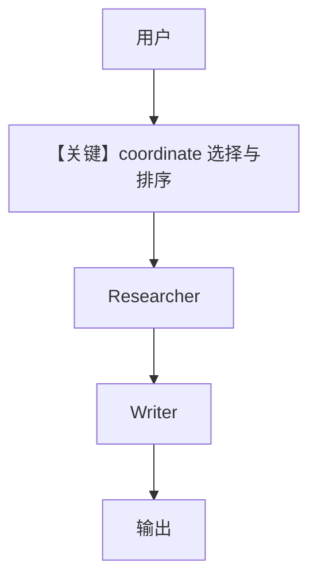

# 01_basic.py — 实现原理分析

> 源文件：`cookbook/03_teams/02_modes/coordinate/01_basic.py`

## 概述

本示例展示 **TeamMode.coordinate**：队长分析请求后 **选择** 成员并分派子任务，再合成；与 broadcast「全员同一题」不同，此处强调 **顺序委托**（先 Researcher 后 Writer）。

**核心配置一览：**

| 配置项 | 值 |
|--------|-----|
| `mode` | `TeamMode.coordinate` |

## System Prompt 组装

```text
You lead a research and writing team.
For informational requests, ask the Researcher to gather facts first,
then ask the Writer to polish the findings into a final piece.
Synthesize everything into a cohesive response.

Use markdown to format your answers.
```

## Mermaid 流程图


```mermaid
flowchart TD
    U["用户"] --> L["【关键】coordinate 选择与排序"]
    L --> R["Researcher"]
    R --> W["Writer"]
    W --> O["输出"]
```

- **【关键】coordinate 选择与排序**：非全员广播。

## 关键源码文件索引

| 文件 | 作用 |
|------|------|
| `agno/team/mode.py` | `TeamMode.coordinate` |
| `agno/team/team.py` | `Team` |
