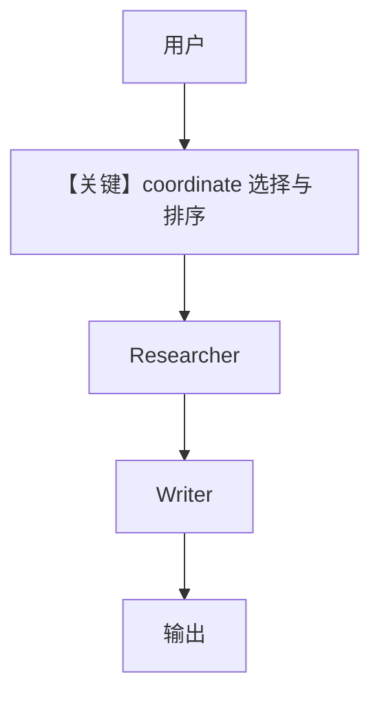

# 01_basic.py — 实现原理分析

<!-- cookbook-py-source:start -->
## 完整源码

```python
"""
Basic Coordinate Mode Example

Demonstrates the default `mode=coordinate` where the team leader:
1. Analyzes the user's request
2. Selects the most appropriate member agent(s)
3. Crafts specific tasks for each selected member
4. Synthesizes member responses into a final answer

"""

from agno.agent import Agent
from agno.models.openai import OpenAIResponses
from agno.team.mode import TeamMode
from agno.team.team import Team

# ---------------------------------------------------------------------------
# Create Members
# ---------------------------------------------------------------------------

researcher = Agent(
    name="Researcher",
    role="Research specialist who finds and summarizes information",
    model=OpenAIResponses(id="gpt-5.2"),
    instructions=[
        "You are a research specialist.",
        "Provide clear, factual summaries on any topic.",
        "Organize findings with structure and cite limitations.",
    ],
)

writer = Agent(
    name="Writer",
    role="Content writer who crafts polished, engaging text",
    model=OpenAIResponses(id="gpt-5.2"),
    instructions=[
        "You are a skilled content writer.",
        "Transform raw information into well-structured, readable text.",
        "Use headers, bullet points, and clear prose.",
    ],
)

# ---------------------------------------------------------------------------
# Create Team
# ---------------------------------------------------------------------------

team = Team(
    name="Research & Writing Team",
    mode=TeamMode.coordinate,
    model=OpenAIResponses(id="gpt-5.2"),
    members=[researcher, writer],
    instructions=[
        "You lead a research and writing team.",
        "For informational requests, ask the Researcher to gather facts first,",
        "then ask the Writer to polish the findings into a final piece.",
        "Synthesize everything into a cohesive response.",
    ],
    show_members_responses=True,
    markdown=True,
)

# ---------------------------------------------------------------------------
# Run Team
# ---------------------------------------------------------------------------

if __name__ == "__main__":
    team.print_response(
        "Write a brief overview of how large language models are trained, "
        "covering pre-training, fine-tuning, and RLHF.",
        stream=True,
    )
```

<!-- cookbook-py-source:end -->

> 源文件：`cookbook/03_teams/02_modes/coordinate/01_basic.py`

## 概述

本示例展示 **TeamMode.coordinate**：队长分析请求后 **选择** 成员并分派子任务，再合成；与 broadcast「全员同一题」不同，此处强调 **顺序委托**（先 Researcher 后 Writer）。

**核心配置一览：**

| 配置项 | 值 |
|--------|-----|
| `mode` | `TeamMode.coordinate` |

## System Prompt 组装

```text
You lead a research and writing team.
For informational requests, ask the Researcher to gather facts first,
then ask the Writer to polish the findings into a final piece.
Synthesize everything into a cohesive response.

Use markdown to format your answers.
```

## Mermaid 流程图


```mermaid
flowchart TD
    U["用户"] --> L["【关键】coordinate 选择与排序"]
    L --> R["Researcher"]
    R --> W["Writer"]
    W --> O["输出"]
```

- **【关键】coordinate 选择与排序**：非全员广播。

## 关键源码文件索引

| 文件 | 作用 |
|------|------|
| `agno/team/mode.py` | `TeamMode.coordinate` |
| `agno/team/team.py` | `Team` |
