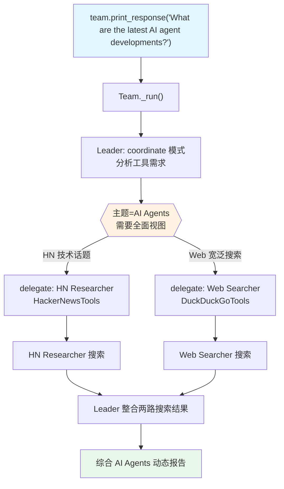

# 02_with_tools.py — 实现原理分析

> 源文件：`cookbook/03_teams/02_modes/coordinate/02_with_tools.py`

## 概述

本示例展示 Agno 的 **coordinate 模式 + 工具路由**机制：两名成员 Agent 各自持有不同工具（HackerNewsTools、DuckDuckGoTools），Team Leader 根据请求的主题特性决定调用哪个成员（或同时调用两者）。这展示了 coordinate 模式的核心优势——根据"谁有合适的工具"智能匹配任务。

**核心配置一览：**

| 配置项 | 值 | 说明 |
|--------|------|------|
| `name` | `"News Research Team"` | Team 名称 |
| `model` | `OpenAIResponses(id="gpt-5.2")` | Leader 使用 Responses API |
| `mode` | `TeamMode.coordinate` | 协调模式（显式） |
| `members` | `[hn_researcher, web_searcher]` | 两名工具成员 |
| `instructions` | `[str, str, str, str, str]` | 5 条工具选择指令 |
| `show_members_responses` | `True` | 显示成员响应 |
| `markdown` | `True` | 启用 markdown 格式化 |

| 成员 | `name` | `model` | `role` | `tools` |
|------|--------|---------|--------|---------|
| hn_researcher | `"HackerNews Researcher"` | `OpenAIResponses(id="gpt-5.2")` | `"Searches and summarizes stories from Hacker News"` | `[HackerNewsTools()]` |
| web_searcher | `"Web Searcher"` | `OpenAIResponses(id="gpt-5.2")` | `"Searches the web for general information"` | `[DuckDuckGoTools()]` |

## 架构分层

```
用户代码层                  agno.team 层（coordinate + 工具路由）
┌─────────────────────┐    ┌────────────────────────────────────────────┐
│ 02_with_tools.py    │    │ Team._run()                                │
│                     │    │  ├─ get_system_message()                   │
│ team.print_response │───>│  │    2成员XML(含工具信息) + coordinate指令│
│   ("What are the   │    │  │    5条 Leader instructions              │
│    latest AI agent │    │  ├─ Leader → 工具感知路由决策               │
│    developments?") │    │  │    "Check both HN and web"              │
└─────────────────────┘    └────────────────────────────────────────────┘
                                       │
                           ┌───────────┴───────────┐
                           ▼                       ▼
          ┌─────────────────────────┐  ┌─────────────────────────┐
          │ HN Researcher._run()    │  │ Web Searcher._run()      │
          │ + HackerNewsTools       │  │ + DuckDuckGoTools        │
          │ (搜索 HN 帖子)          │  │ (搜索网络新闻)           │
          └─────────────────────────┘  └─────────────────────────┘
```

## 核心组件解析

### 基于工具的路由决策

Leader 的 instructions 明确规定了工具路由逻辑：
- 技术/创业话题 → HackerNews Researcher（使用 HackerNewsTools）
- 宽泛话题 → Web Searcher（使用 DuckDuckGoTools）
- 全面视图需求 → **两者都用**

这是 coordinate 模式的典型使用场景：Leader 知道"谁有什么工具"，按需委派。

### `add_member_tools_to_context`

Team 未设置 `add_member_tools_to_context=True`（默认 False），所以 Leader 的 `<team_members>` XML 中**不包含**成员的工具名称。Leader 仅通过成员的 `role` 字段推断其能力（`_messages.py` L103-106）。如需让 Leader 明确看到成员工具，需设置 `add_member_tools_to_context=True`。

```python
# team/team.py L165
add_member_tools_to_context: bool = False  # 默认不添加工具信息
```

成员的工具信息注入**成员自身**的 system prompt（通过 `Agent._messages.get_system_message()` 中的 `_tool_instructions`），而非 Leader 的 system prompt。

## System Prompt 组装

### Team Leader

| 序号 | 组成部分 | 本文件中的值/来源 | 是否生效 |
|------|---------|-----------------|---------|
| 2.1 | 开场词 + `<team_members>` XML | HN Researcher / Web Searcher（仅 role） | 是 |
| 2.1 | `<how_to_respond>` coordinate 模式 | `mode=TeamMode.coordinate` | 是 |
| 2.2 | `instructions` 拼接 | 5 条工具路由指令 | 是 |
| - | `markdown` | `True` → "Use markdown..." | 是 |

### 成员（以 HN Researcher 为例）

```text
<your_role>Searches and summarizes stories from Hacker News</your_role>
- You search Hacker News for relevant stories.
- Provide titles, scores, and brief summaries of what you find.
[HackerNewsTools 工具使用说明由 get_instructions_for_model() 注入]
```

## 完整 API 请求

**Leader（同时委派两成员）：**

```python
client.responses.create(
    model="gpt-5.2",
    input=[
        {"role": "developer", "content": "You coordinate a team...<team_members>\n<member id=\"HackerNews Researcher\"..."},
        {"role": "user", "content": "What are the latest developments in AI agents? Check both Hacker News and the web."}
    ],
    tools=[{"type": "function", "name": "delegate_task_to_member", ...}],
    stream=True
)
# Leader 依次调用：
# 1. delegate_task_to_member(member_id="HackerNews Researcher", task="Search HN for AI agents...")
# 2. delegate_task_to_member(member_id="Web Searcher", task="Search web for AI agents...")
```

## Mermaid 流程图



## 关键源码文件索引

| 文件 | 关键函数/类 | 作用 |
|------|------------|------|
| `agno/team/team.py` | `add_member_tools_to_context` L165 | 控制工具信息是否注入 Leader 上下文 |
| `agno/team/_messages.py` | `_get_tool_names()` L55 | 提取成员工具名称 |
| `agno/tools/hackernews.py` | `HackerNewsTools` | HN 工具集 |
| `agno/tools/duckduckgo.py` | `DuckDuckGoTools` | DuckDuckGo 搜索工具 |
