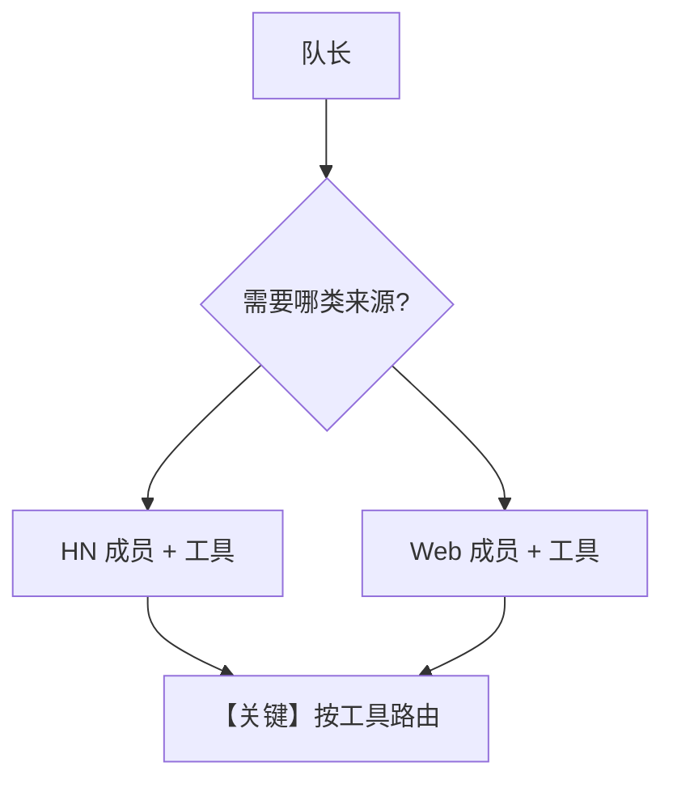

# 02_with_tools.py — 实现原理分析

<!-- cookbook-py-source:start -->
## 完整源码

```python
"""
Coordinate Mode with Tools

Demonstrates coordination where member agents have specialized tools.
The team leader delegates to the right member based on what tools are needed.

"""

from agno.agent import Agent
from agno.models.openai import OpenAIResponses
from agno.team.mode import TeamMode
from agno.team.team import Team
from agno.tools.duckduckgo import DuckDuckGoTools
from agno.tools.hackernews import HackerNewsTools

# ---------------------------------------------------------------------------
# Tools
# ---------------------------------------------------------------------------

hn_researcher = Agent(
    name="HackerNews Researcher",
    role="Searches and summarizes stories from Hacker News",
    model=OpenAIResponses(id="gpt-5.2"),
    tools=[HackerNewsTools()],
    instructions=[
        "You search Hacker News for relevant stories.",
        "Provide titles, scores, and brief summaries of what you find.",
    ],
)

web_searcher = Agent(
    name="Web Searcher",
    role="Searches the web for general information",
    model=OpenAIResponses(id="gpt-5.2"),
    tools=[DuckDuckGoTools()],
    instructions=[
        "You search the web for relevant information.",
        "Provide concise summaries with key facts.",
    ],
)

# ---------------------------------------------------------------------------
# Create Team
# ---------------------------------------------------------------------------

team = Team(
    name="News Research Team",
    mode=TeamMode.coordinate,
    model=OpenAIResponses(id="gpt-5.2"),
    members=[hn_researcher, web_searcher],
    instructions=[
        "You lead a news research team.",
        "For tech/startup topics, use the HackerNews Researcher.",
        "For broader topics, use the Web Searcher.",
        "You can use both when a comprehensive view is needed.",
        "Synthesize findings into a clear summary.",
    ],
    show_members_responses=True,
    markdown=True,
)

# ---------------------------------------------------------------------------
# Run Team
# ---------------------------------------------------------------------------

if __name__ == "__main__":
    team.print_response(
        "What are the latest developments in AI agents? "
        "Check both Hacker News and the web.",
        stream=True,
    )
```

<!-- cookbook-py-source:end -->

> 源文件：`cookbook/03_teams/02_modes/coordinate/02_with_tools.py`

## 概述

**TeamMode.coordinate** 下成员携带 **异构工具**（HN vs Web），队长按主题将任务派给 **最匹配工具** 的成员，必要时两者兼顾。

**核心配置一览：**

| 配置项 | 值 |
|--------|-----|
| `mode` | `TeamMode.coordinate` |
| `tools` | `HackerNewsTools`, `DuckDuckGoTools` |

## System Prompt 组装

```text
You lead a news research team.
For tech/startup topics, use the HackerNews Researcher.
For broader topics, use the Web Searcher.
You can use both when a comprehensive view is needed.
Synthesize findings into a clear summary.

Use markdown to format your answers.
```

## Mermaid 流程图


```mermaid
flowchart TD
    L["队长"] --> D{"需要哪类来源?"}
    D --> H["HN 成员 + 工具"]
    D --> W["Web 成员 + 工具"]
    H --> S["【关键】按工具路由"]
    W --> S
```

- **【关键】按工具路由**：coordinate 与成员 toolkit 绑定。

## 关键源码文件索引

| 文件 | 作用 |
|------|------|
| `agno/team/team.py` | `add_member_tools_to_context` 等可选 |
