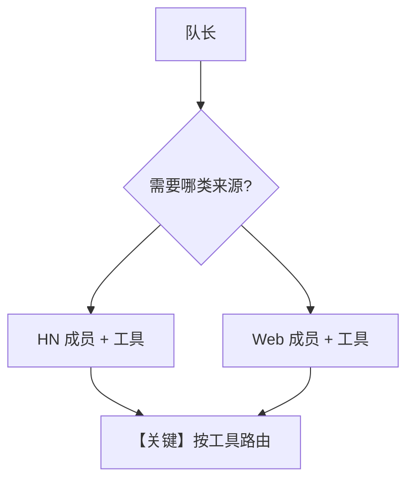

# 02_with_tools.py — 实现原理分析

> 源文件：`cookbook/03_teams/02_modes/coordinate/02_with_tools.py`

## 概述

**TeamMode.coordinate** 下成员携带 **异构工具**（HN vs Web），队长按主题将任务派给 **最匹配工具** 的成员，必要时两者兼顾。

**核心配置一览：**

| 配置项 | 值 |
|--------|-----|
| `mode` | `TeamMode.coordinate` |
| `tools` | `HackerNewsTools`, `DuckDuckGoTools` |

## System Prompt 组装

```text
You lead a news research team.
For tech/startup topics, use the HackerNews Researcher.
For broader topics, use the Web Searcher.
You can use both when a comprehensive view is needed.
Synthesize findings into a clear summary.

Use markdown to format your answers.
```

## Mermaid 流程图


```mermaid
flowchart TD
    L["队长"] --> D{"需要哪类来源?"}
    D --> H["HN 成员 + 工具"]
    D --> W["Web 成员 + 工具"]
    H --> S["【关键】按工具路由"]
    W --> S
```

- **【关键】按工具路由**：coordinate 与成员 toolkit 绑定。

## 关键源码文件索引

| 文件 | 作用 |
|------|------|
| `agno/team/team.py` | `add_member_tools_to_context` 等可选 |
