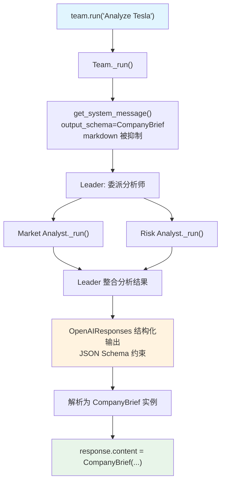

# 03_structured_output.py — 实现原理分析

> 源文件：`cookbook/03_teams/02_modes/coordinate/03_structured_output.py`

## 概述

本示例展示 Agno 的 **Team `output_schema` 结构化输出**机制：Team Leader 在协调成员（Market Analyst + Risk Analyst）完成分析后，将最终响应强制格式化为 `CompanyBrief` Pydantic 模型。OpenAIResponses 模型支持原生结构化输出（`supports_native_structured_outputs`），因此 Agno 使用 JSON Schema 约束而非在 system prompt 中注入 JSON 格式提示。

**核心配置一览：**

| 配置项 | 值 | 说明 |
|--------|------|------|
| `name` | `"Company Analysis Team"` | Team 名称 |
| `model` | `OpenAIResponses(id="gpt-5.2")` | Leader 使用 Responses API |
| `mode` | `TeamMode.coordinate` | 协调模式 |
| `members` | `[market_analyst, risk_analyst]` | 两名分析师 |
| `instructions` | `[str, str, str, str]` | 4 条分析流程指令 |
| `output_schema` | `CompanyBrief` | Pydantic 结构化输出模型 |
| `show_members_responses` | `True` | 显示成员响应 |
| `markdown` | `False`（未设置） | 未启用（output_schema 存在时自动禁用 markdown） |

**CompanyBrief 结构：**

| 字段 | 类型 | 描述 |
|------|------|------|
| `company_name` | `str` | 公司名称 |
| `industry` | `str` | 主要行业 |
| `strengths` | `List[str]` | 竞争优势列表 |
| `risks` | `List[str]` | 风险/挑战列表 |
| `outlook` | `str` | 前景评估 |

## 架构分层

```
用户代码层                  agno.team 层（coordinate + 结构化输出）
┌────────────────────────┐  ┌────────────────────────────────────────────┐
│ 03_structured_output.py│  │ Team._run()                                │
│                        │  │  ├─ get_system_message()                   │
│ response = team.run(   │->│  │    output_schema=CompanyBrief 传入      │
│   "Analyze Tesla")     │  │  │    markdown=False（output_schema抑制）  │
│                        │  │  ├─ Leader 委派两成员                      │
│ pprint(response        │  │  ├─ 整合成员响应                           │
│   .content             │  │  └─ 结构化输出：CompanyBrief 实例          │
│   .model_dump())       │  └────────────────────────────────────────────┘
└────────────────────────┘              │
                             ┌──────────┴──────────┐
                             ▼                     ▼
                   ┌────────────────┐  ┌────────────────────┐
                   │ Market Analyst │  │ Risk Analyst       │
                   │ 市场竞争分析   │  │ 风险识别分析       │
                   └────────────────┘  └────────────────────┘
                                           │
                                ┌──────────┘
                                ▼
                   ┌──────────────────────┐
                   │ OpenAIResponses       │
                   │ gpt-5.2              │
                   │ JSON Schema 约束输出  │
                   └──────────────────────┘
```

## 核心组件解析

### `output_schema` 对 Team 的影响

当 Team 设置了 `output_schema` 时（`team.py` L263），以下行为发生变化：

1. **markdown 抑制**：`_build_trailing_sections()` 中，`output_schema is not None` 会跳过 `"Use markdown..."` 的注入（`_messages.py` L413）
2. **JSON Schema 约束**：OpenAIResponses 支持原生结构化输出，因此 Agno 将 `CompanyBrief` 的 JSON Schema 作为 `text.format` 参数传给 API，而非在 system prompt 中添加 JSON 格式提示
3. **返回类型**：`team.run()` 返回的 `response.content` 是 `CompanyBrief` 实例（已解析），而非字符串

### 结构化输出的处理路径

```python
# team/_response.py — 结构化输出解析
# OpenAIResponses 支持 native structured outputs：
# → 使用 response_format={"type": "json_schema", "json_schema": {...}} 约束
# → 模型直接返回合法 JSON
# → Agno 将 JSON 解析为 CompanyBrief 实例
```

### 成员 Agent 不使用 `output_schema`

成员 Agent（Market Analyst、Risk Analyst）没有 `output_schema`，它们自由格式响应。只有 **Team Leader 的最终输出**被强制为 `CompanyBrief` 结构。

## System Prompt 组装（Team Leader）

| 序号 | 组成部分 | 本文件中的值/来源 | 是否生效 |
|------|---------|-----------------|---------|
| 2.1 | 开场词 + `<team_members>` XML | Market/Risk Analyst + role | 是 |
| 2.1 | `<how_to_respond>` coordinate 模式 | `mode=TeamMode.coordinate` | 是 |
| 2.2 | `instructions` 拼接 | 4 条分析指令 | 是 |
| - | `markdown` | `False`（output_schema 抑制） | 否 |
| - | JSON output prompt | OpenAIResponses 原生支持，不注入 prompt | 否 |
| - | response_format（JSON Schema） | `CompanyBrief` JSON Schema | 是（API 层） |

## 完整 API 请求（Leader，含结构化输出约束）

```python
client.responses.create(
    model="gpt-5.2",
    input=[
        {"role": "developer", "content": "You coordinate a team..."},
        {"role": "user", "content": "Analyze Tesla as a company."},
        # 成员响应（工具调用结果）已加入 input...
    ],
    tools=[{"type": "function", "name": "delegate_task_to_member", ...}],
    # OpenAIResponses 原生结构化输出（Responses API 格式）
    text={
        "format": {
            "type": "json_schema",
            "name": "CompanyBrief",
            "schema": {
                "type": "object",
                "properties": {
                    "company_name": {"type": "string"},
                    "industry": {"type": "string"},
                    "strengths": {"type": "array", "items": {"type": "string"}},
                    "risks": {"type": "array", "items": {"type": "string"}},
                    "outlook": {"type": "string"}
                },
                "required": ["company_name", "industry", "strengths", "risks", "outlook"]
            }
        }
    },
    stream=False  # team.run() 同步非流式
)
```

## Mermaid 流程图



## 关键源码文件索引

| 文件 | 关键函数/类 | 作用 |
|------|------------|------|
| `agno/team/team.py` | `output_schema` L263 | Pydantic 结构化输出模型 |
| `agno/team/_messages.py` | `_build_trailing_sections()` L254 | output_schema 抑制 markdown |
| `agno/team/_response.py` | `model_should_return_structured_output()` | 判断是否使用原生结构化输出 |
| `agno/models/openai/responses.py` | `supports_native_structured_outputs` | OpenAIResponses 原生约束支持 |
