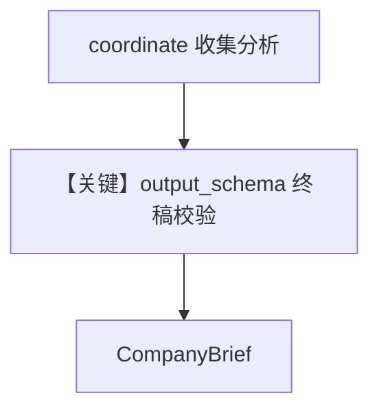

# 03_structured_output.py — 实现原理分析

<!-- cookbook-py-source:start -->
## 完整源码

```python
"""
Coordinate Mode with Structured Output

Demonstrates coordination that produces a Pydantic-validated structured response.
The team leader coordinates members and formats the final output to match a schema.

"""

from typing import List

from agno.agent import Agent
from agno.models.openai import OpenAIResponses
from agno.team.mode import TeamMode
from agno.team.team import Team
from pydantic import BaseModel, Field

# ---------------------------------------------------------------------------
# Output Schema
# ---------------------------------------------------------------------------


class CompanyBrief(BaseModel):
    company_name: str = Field(..., description="Name of the company")
    industry: str = Field(..., description="Primary industry")
    strengths: List[str] = Field(..., description="Key competitive strengths")
    risks: List[str] = Field(..., description="Notable risks or challenges")
    outlook: str = Field(..., description="Brief forward-looking assessment")


# ---------------------------------------------------------------------------
# Create Members
# ---------------------------------------------------------------------------

market_analyst = Agent(
    name="Market Analyst",
    role="Analyzes market position and competitive landscape",
    model=OpenAIResponses(id="gpt-5.2"),
    instructions=[
        "You analyze companies from a market and competitive perspective.",
        "Focus on market share, competitors, and strategic positioning.",
    ],
)

risk_analyst = Agent(
    name="Risk Analyst",
    role="Identifies risks and challenges facing a company",
    model=OpenAIResponses(id="gpt-5.2"),
    instructions=[
        "You identify and assess risks facing companies.",
        "Consider regulatory, financial, operational, and market risks.",
    ],
)

# ---------------------------------------------------------------------------
# Output Schema
# ---------------------------------------------------------------------------

team = Team(
    name="Company Analysis Team",
    mode=TeamMode.coordinate,
    model=OpenAIResponses(id="gpt-5.2"),
    members=[market_analyst, risk_analyst],
    instructions=[
        "You lead a company analysis team.",
        "Ask the Market Analyst for competitive analysis.",
        "Ask the Risk Analyst for risk assessment.",
        "Combine their insights into a structured company brief.",
    ],
    output_schema=CompanyBrief,
    show_members_responses=True,
)

# ---------------------------------------------------------------------------
# Run Team
# ---------------------------------------------------------------------------

if __name__ == "__main__":
    from rich.pretty import pprint

    response = team.run("Analyze Tesla as a company.")
    if response and isinstance(response.content, CompanyBrief):
        pprint(response.content.model_dump())
    elif response:
        print(response.content)
    else:
        print("No response")
```

<!-- cookbook-py-source:end -->

> 源文件：`cookbook/03_teams/02_modes/coordinate/03_structured_output.py`

## 概述

本示例展示 **Team.output_schema**：队长在协调 Market / Risk 两成员后，将 **最终** 输出约束为 Pydantic 模型 `CompanyBrief`；与单 Agent `output_schema` 类似，但拼装发生在 Team run 收尾阶段（`team/_messages.py` 等对 Team 的 schema 提示与 `team.py` 字段）。

**核心配置一览：**

| 配置项 | 值 |
|--------|-----|
| `mode` | `TeamMode.coordinate` |
| `output_schema` | `CompanyBrief` (Pydantic) |
| `markdown` | 未显式 True（Team 默认 False） |

## 核心组件解析

`team.run("Analyze Tesla...")` 返回 `TeamRunOutput`；`response.content` 在成功解析时为 `CompanyBrief` 实例。

### 运行机制与因果链

成员可自由文本；**队长**最后一步将综合结果 **结构化** 为 schema（具体约束见 Team 对 structured output 的处理）。

## System Prompt 组装

队长 instructions：

```text
You lead a company analysis team.
Ask the Market Analyst for competitive analysis.
Ask the Risk Analyst for risk assessment.
Combine their insights into a structured company brief.
```

Schema 相关附加段由 Team/模型适配器在启用 `output_schema` 时注入（见 `team/_messages.py` 中与 JSON/schema 相关分支，约 L300+ `_get_json_output_prompt` 调用链）。

## 完整 API 请求

`OpenAIResponses` 在 structured output 时走原生 JSON/schema 路径（`supports_native_structured_outputs`）。

## Mermaid 流程图


```mermaid
flowchart TD
    C["coordinate 收集分析"] --> J["【关键】output_schema 终稿校验"]
    J --> P["CompanyBrief"]
```

- **【关键】output_schema 终稿校验**：Team 级结构化输出。

## 关键源码文件索引

| 文件 | 作用 |
|------|------|
| `agno/team/_messages.py` | schema 提示、L300 附近模型段 |
| `agno/team/team.py` | `output_schema` 字段 |
