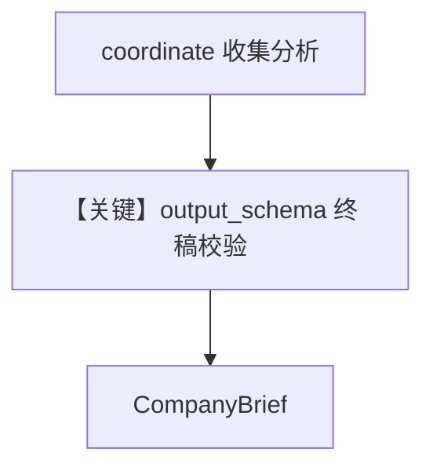

# 03_structured_output.py — 实现原理分析

> 源文件：`cookbook/03_teams/02_modes/coordinate/03_structured_output.py`

## 概述

本示例展示 **Team.output_schema**：队长在协调 Market / Risk 两成员后，将 **最终** 输出约束为 Pydantic 模型 `CompanyBrief`；与单 Agent `output_schema` 类似，但拼装发生在 Team run 收尾阶段（`team/_messages.py` 等对 Team 的 schema 提示与 `team.py` 字段）。

**核心配置一览：**

| 配置项 | 值 |
|--------|-----|
| `mode` | `TeamMode.coordinate` |
| `output_schema` | `CompanyBrief` (Pydantic) |
| `markdown` | 未显式 True（Team 默认 False） |

## 核心组件解析

`team.run("Analyze Tesla...")` 返回 `TeamRunOutput`；`response.content` 在成功解析时为 `CompanyBrief` 实例。

### 运行机制与因果链

成员可自由文本；**队长**最后一步将综合结果 **结构化** 为 schema（具体约束见 Team 对 structured output 的处理）。

## System Prompt 组装

队长 instructions：

```text
You lead a company analysis team.
Ask the Market Analyst for competitive analysis.
Ask the Risk Analyst for risk assessment.
Combine their insights into a structured company brief.
```

Schema 相关附加段由 Team/模型适配器在启用 `output_schema` 时注入（见 `team/_messages.py` 中与 JSON/schema 相关分支，约 L300+ `_get_json_output_prompt` 调用链）。

## 完整 API 请求

`OpenAIResponses` 在 structured output 时走原生 JSON/schema 路径（`supports_native_structured_outputs`）。

## Mermaid 流程图


```mermaid
flowchart TD
    C["coordinate 收集分析"] --> J["【关键】output_schema 终稿校验"]
    J --> P["CompanyBrief"]
```

- **【关键】output_schema 终稿校验**：Team 级结构化输出。

## 关键源码文件索引

| 文件 | 作用 |
|------|------|
| `agno/team/_messages.py` | schema 提示、L300 附近模型段 |
| `agno/team/team.py` | `output_schema` 字段 |
