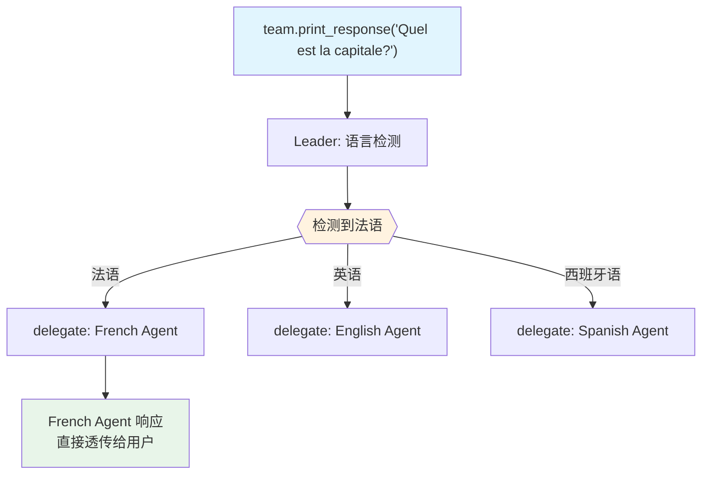

# 01_basic.py — 实现原理分析

> 源文件：`cookbook/03_teams/02_modes/route/01_basic.py`

## 概述

本示例展示 Agno 的 **route 模式语言路由**基础用法：Team Leader 检测用户输入语言，将请求路由到对应的语言专家 Agent（English/Spanish/French），成员的响应**直接返回给用户**（不经 Leader 合并）。这是 route 模式的核心特性——Leader 仅作"路由器"，不参与内容生成。

**核心配置一览：**

| 配置项 | 值 | 说明 |
|--------|------|------|
| `name` | `"Language Router"` | Team 名称 |
| `model` | `OpenAIResponses(id="gpt-5.2")` | Leader |
| `mode` | `TeamMode.route` | 路由模式 |
| `members` | `[english_agent, spanish_agent, french_agent]` | 3 个语言成员 |
| `instructions` | `[str, str, str]` | 路由规则指令 |
| `show_members_responses` | `True` | 显示成员响应 |
| `markdown` | `True` | markdown 格式 |

| 成员 | `name` | `role` | `instructions` |
|------|--------|--------|----------------|
| english_agent | `"English Agent"` | `"Responds only in English"` | 始终用英文回复 |
| spanish_agent | `"Spanish Agent"` | `"Responds only in Spanish"` | 始终用西班牙文回复 |
| french_agent | `"French Agent"` | `"Responds only in French"` | 始终用法文回复 |

## 核心组件解析

### route 模式的关键行为

Leader 在 route 模式下：
1. 分析输入语言
2. 选择**一个**最匹配的成员
3. 调用 `delegate_task_to_member(member_id, task)`
4. 将该成员的响应**直接透传**给用户（不做合并）

不支持的语言默认路由到 English Agent（由 instructions 规定）。

### System Prompt（Leader）

```text
<how_to_respond>
You operate in route mode. For requests that need member expertise,
identify the single best member and delegate to them —
their response is returned directly to the user. ...
</how_to_respond>
- You are a language router.
- Detect the language of the user's message and route to the matching agent.
- If the language is not supported, default to the English Agent.
```

## Mermaid 流程图



## 关键源码文件索引

| 文件 | 关键函数/类 | 作用 |
|------|------------|------|
| `agno/team/mode.py` | `TeamMode.route` | 路由模式枚举 |
| `agno/team/_messages.py` | `_get_mode_instructions()` L148-158 | route 模式指令 |
| `agno/team/_default_tools.py` | `delegate_task_to_member()` L475 | 单成员委派（直接透传） |
