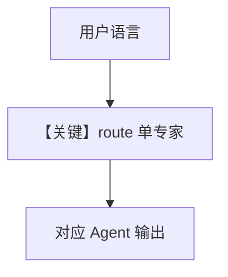

# 01_basic.py — 实现原理分析

<!-- cookbook-py-source:start -->
## 完整源码

```python
"""
Basic Route Mode Example

Demonstrates `mode=route` where the team leader routes each request to
a single specialist agent and returns their response directly (no synthesis).

This is ideal for language routing, domain dispatch, or any scenario where
one specialist should handle the entire request.

"""

from agno.agent import Agent
from agno.models.openai import OpenAIResponses
from agno.team.mode import TeamMode
from agno.team.team import Team

# ---------------------------------------------------------------------------
# Create Members
# ---------------------------------------------------------------------------

english_agent = Agent(
    name="English Agent",
    role="Responds only in English",
    model=OpenAIResponses(id="gpt-5.2"),
    instructions=["Always respond in English, regardless of the input language."],
)

spanish_agent = Agent(
    name="Spanish Agent",
    role="Responds only in Spanish",
    model=OpenAIResponses(id="gpt-5.2"),
    instructions=["Always respond in Spanish, regardless of the input language."],
)

french_agent = Agent(
    name="French Agent",
    role="Responds only in French",
    model=OpenAIResponses(id="gpt-5.2"),
    instructions=["Always respond in French, regardless of the input language."],
)

# ---------------------------------------------------------------------------
# Create Team
# ---------------------------------------------------------------------------

team = Team(
    name="Language Router",
    mode=TeamMode.route,
    model=OpenAIResponses(id="gpt-5.2"),
    members=[english_agent, spanish_agent, french_agent],
    instructions=[
        "You are a language router.",
        "Detect the language of the user's message and route to the matching agent.",
        "If the language is not supported, default to the English Agent.",
    ],
    show_members_responses=True,
    markdown=True,
)

# ---------------------------------------------------------------------------
# Run Team
# ---------------------------------------------------------------------------

if __name__ == "__main__":
    # English
    team.print_response("What is the capital of France?", stream=True)

    print("\n" + "=" * 60 + "\n")

    # Spanish
    team.print_response("Cual es la capital de Francia?", stream=True)

    print("\n" + "=" * 60 + "\n")

    # French
    team.print_response("Quelle est la capitale de la France?", stream=True)
```

<!-- cookbook-py-source:end -->

> 源文件：`cookbook/03_teams/02_modes/route/01_basic.py`

## 概述

**TeamMode.route**：队长将请求路由到 **单一** 专家，并直接返回该成员响应（文档描述为无合成，实际仍受 `show_members_responses` 等影响展示）。本例为 **语言路由**：英/西/法三 Agent，`instructions` 规定不支持语言时走 English。

**核心配置一览：**

| 配置项 | 值 |
|--------|-----|
| `mode` | `TeamMode.route` |

## System Prompt 组装

```text
You are a language router.
Detect the language of the user's message and route to the matching agent.
If the language is not supported, default to the English Agent.

Use markdown to format your answers.
```

## Mermaid 流程图


```mermaid
flowchart TD
    I["用户语言"] --> R["【关键】route 单专家"]
    R --> O["对应 Agent 输出"]
```

- **【关键】route 单专家**：一对一 dispatch。

## 关键源码文件索引

| 文件 | 作用 |
|------|------|
| `agno/team/mode.py` | `TeamMode.route` |
| `agno/team/team.py` | `run` L732+ |
