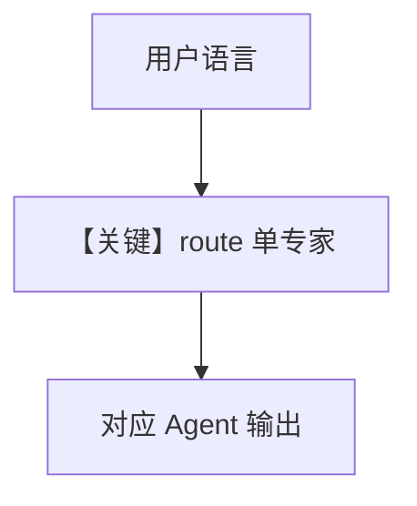

# 01_basic.py — 实现原理分析

> 源文件：`cookbook/03_teams/02_modes/route/01_basic.py`

## 概述

**TeamMode.route**：队长将请求路由到 **单一** 专家，并直接返回该成员响应（文档描述为无合成，实际仍受 `show_members_responses` 等影响展示）。本例为 **语言路由**：英/西/法三 Agent，`instructions` 规定不支持语言时走 English。

**核心配置一览：**

| 配置项 | 值 |
|--------|-----|
| `mode` | `TeamMode.route` |

## System Prompt 组装

```text
You are a language router.
Detect the language of the user's message and route to the matching agent.
If the language is not supported, default to the English Agent.

Use markdown to format your answers.
```

## Mermaid 流程图


```mermaid
flowchart TD
    I["用户语言"] --> R["【关键】route 单专家"]
    R --> O["对应 Agent 输出"]
```

- **【关键】route 单专家**：一对一 dispatch。

## 关键源码文件索引

| 文件 | 作用 |
|------|------|
| `agno/team/mode.py` | `TeamMode.route` |
| `agno/team/team.py` | `run` L732+ |
