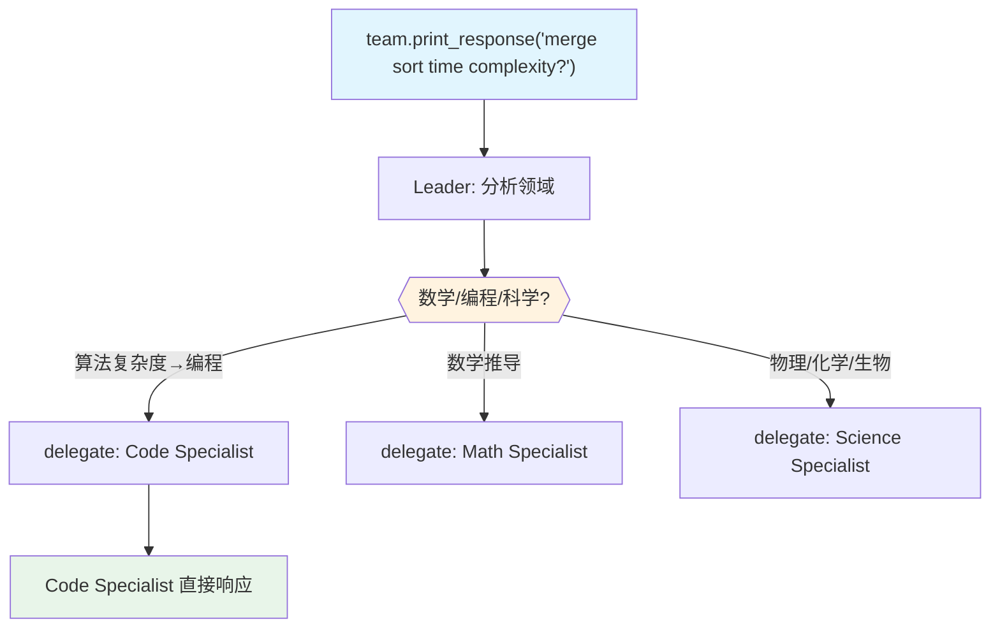

# 02_specialist_router.py — 实现原理分析

> 源文件：`cookbook/03_teams/02_modes/route/02_specialist_router.py`

## 概述

本示例展示 Agno 的 **route 模式领域专家路由**：三名专家（数学/编程/科学）各司其职，Leader 分析问题所属领域并路由到最合适的专家，专家直接响应用户。这是 route 模式在**领域分发**场景中的标准应用。

**核心配置一览：**

| 配置项 | 值 | 说明 |
|--------|------|------|
| `name` | `"Expert Router"` | Team 名称 |
| `model` | `OpenAIResponses(id="gpt-5.2")` | Leader |
| `mode` | `TeamMode.route` | 路由模式 |
| `members` | `[math_agent, code_agent, science_agent]` | 三名领域专家 |
| `instructions` | `[str, str, str, str, str]` | 5 条路由规则 |
| `show_members_responses` | `True` | 显示专家响应 |
| `markdown` | `True` | markdown 格式 |

| 成员 | `name` | `role` | 专业领域 |
|------|--------|--------|---------|
| math_agent | `"Math Specialist"` | 数学问题求解 | 数学，逐步推导 |
| code_agent | `"Code Specialist"` | 编程实现 | 代码编写，权衡分析 |
| science_agent | `"Science Specialist"` | 科学概念解释 | 物理/化学/生物 |

## 核心组件解析

### 明确的路由规则设计

Leader 的 instructions 使用显式的"条件→成员"映射格式，使路由决策清晰且一致：

```
- Math questions -> Math Specialist
- Programming questions -> Code Specialist
- Science questions -> Science Specialist
```

这种格式虽然简单，但对 LLM 路由决策最为有效。

### route 模式 vs coordinate 模式对比

| 维度 | route 模式 | coordinate 模式 |
|------|-----------|----------------|
| 成员选择数 | **1个** | 1个或多个 |
| Leader 合并响应 | **不合并**，直接透传 | 合并所有响应 |
| 成员响应质量 | 专家级别 | 受 Leader 综合能力影响 |
| 延迟 | 更低（少一层合并） | 稍高 |
| 适合场景 | 单一专业领域问题 | 跨领域综合问题 |

## System Prompt（Leader 节选）

```text
<how_to_respond>
You operate in route mode. identify the single best member and delegate to them...
When routing to a member:
- Analyze the request to determine which member's role and tools are the best match.
- Delegate to exactly one member.
</how_to_respond>
- You are an expert router.
- Analyze the user's question and route it to the best specialist:
- - Math questions -> Math Specialist
- - Programming questions -> Code Specialist
- - Science questions -> Science Specialist
```

## Mermaid 流程图



## 关键源码文件索引

| 文件 | 关键函数/类 | 作用 |
|------|------------|------|
| `agno/team/mode.py` | `TeamMode.route` | 路由模式 |
| `agno/team/_default_tools.py` | `delegate_task_to_member()` L475 | 单成员委派 |
