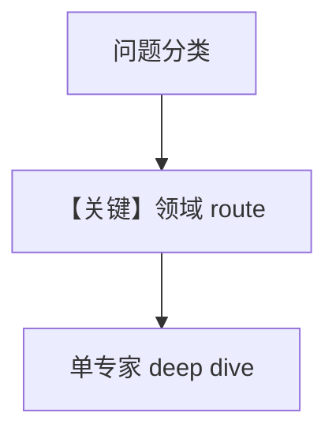

# 02_specialist_router.py — 实现原理分析

> 源文件：`cookbook/03_teams/02_modes/route/02_specialist_router.py`

## 概述

**TeamMode.route** 的 **领域路由**：数学 / 编程 / 科学 三专家，队长 `instructions` 用 bullet 规定映射规则；示例问题为算法复杂度（偏数学）。

**核心配置一览：**

| 配置项 | 值 |
|--------|-----|
| `mode` | `TeamMode.route` |
| `members` | math_agent, code_agent, science_agent |

## System Prompt 组装

```text
You are an expert router.
Analyze the user's question and route it to the best specialist:
- Math questions -> Math Specialist
- Programming questions -> Code Specialist
- Science questions -> Science Specialist

Use markdown to format your answers.
```

## Mermaid 流程图


```mermaid
flowchart TD
    Q["问题分类"] --> R["【关键】领域 route"]
    R --> S["单专家 deep dive"]
```

- **【关键】领域 route**：与语言路由同模式不同语义。

## 关键源码文件索引

| 文件 | 作用 |
|------|------|
| `agno/team/_messages.py` | 队长 `get_system_message` L328+ |
