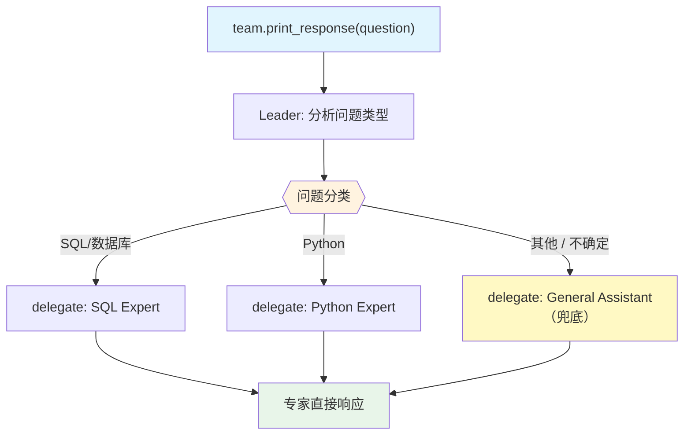

# 03_with_fallback.py — 实现原理分析

> 源文件：`cookbook/03_teams/02_modes/route/03_with_fallback.py`

## 概述

本示例展示 Agno 的 **route 模式 + 兜底成员（fallback）**设计：两名专家（SQL/Python）处理对口问题，`General Assistant` 作为通用兜底，处理不匹配任何专家的请求。Leader 的 instructions 明确规定"当不确定时路由到 General Assistant"，避免路由失败。

**核心配置一览：**

| 配置项 | 值 | 说明 |
|--------|------|------|
| `name` | `"Dev Help Router"` | Team 名称 |
| `model` | `OpenAIResponses(id="gpt-5.2")` | Leader |
| `mode` | `TeamMode.route` | 路由模式 |
| `members` | `[sql_agent, python_agent, general_agent]` | 2 专家 + 1 兜底 |
| `instructions` | `[str, str, str, str, str]` | 5 条路由规则（含兜底） |
| `show_members_responses` | `True` | 显示成员响应 |
| `markdown` | `True` | markdown 格式 |

| 成员 | `name` | `role` | 场景 |
|------|--------|--------|------|
| sql_agent | `"SQL Expert"` | SQL 查询和优化 | SQL/数据库问题 |
| python_agent | `"Python Expert"` | Python 代码 | Python 问题 |
| general_agent | `"General Assistant"` | 通用助手 | **兜底**：所有其他问题 |

## 核心组件解析

### Fallback 模式的设计原则

在 route 模式中，如果没有明确的兜底成员，当问题不匹配任何专家时 Leader 可能做出不一致的路由决定。引入 General Assistant + 明确的"When in doubt"规则可以：

1. **消除路由模糊性**：Leader 不需要在不合适的专家中"猜最接近的"
2. **保持专家纯粹性**：SQL Expert 只处理 SQL，不被迫回答通用问题
3. **用户体验一致**：任何问题都有明确的处理者

### instructions 中的兜底规则

```python
instructions=[
    "You route questions to the right expert.",
    "- SQL or database questions -> SQL Expert",
    "- Python questions -> Python Expert",
    "- Everything else -> General Assistant",  # 明确的兜底指令
    "When in doubt, route to the General Assistant.",  # 兜底决策规则
]
```

## Mermaid 流程图



## 关键源码文件索引

| 文件 | 关键函数/类 | 作用 |
|------|------------|------|
| `agno/team/mode.py` | `TeamMode.route` | 路由模式 |
| `agno/team/_default_tools.py` | `delegate_task_to_member()` L475 | 单成员委派 |
