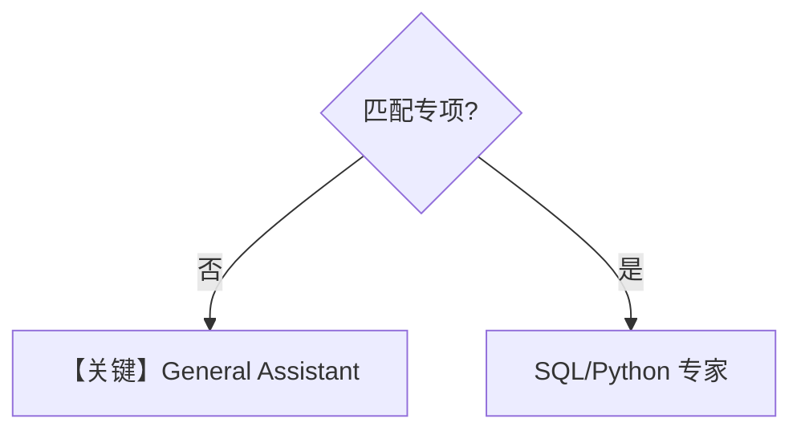

# 03_with_fallback.py — 实现原理分析

> 源文件：`cookbook/03_teams/02_modes/route/03_with_fallback.py`

## 概述

**TeamMode.route** 带 **兜底专家**：SQL / Python / General；队长指令明确「拿不准则 General Assistant」，演示两趟 `print_response`（SQL 专项 vs 通用软技能问题）。

**核心配置一览：**

| 配置项 | 值 |
|--------|-----|
| `mode` | `TeamMode.route` |
| `members` | 含 `general_agent` |

## System Prompt 组装

```text
You route questions to the right expert.
- SQL or database questions -> SQL Expert
- Python questions -> Python Expert
- Everything else -> General Assistant
When in doubt, route to the General Assistant.

Use markdown to format your answers.
```

## Mermaid 流程图


```mermaid
flowchart TD
    D{"匹配专项?"} -->|否| F["【关键】General Assistant"]
    D -->|是| S["SQL/Python 专家"]
```

- **【关键】General Assistant**：显式 fallback 路径。

## 关键源码文件索引

| 文件 | 作用 |
|------|------|
| `agno/team/team.py` | `Team` 路由执行 |
