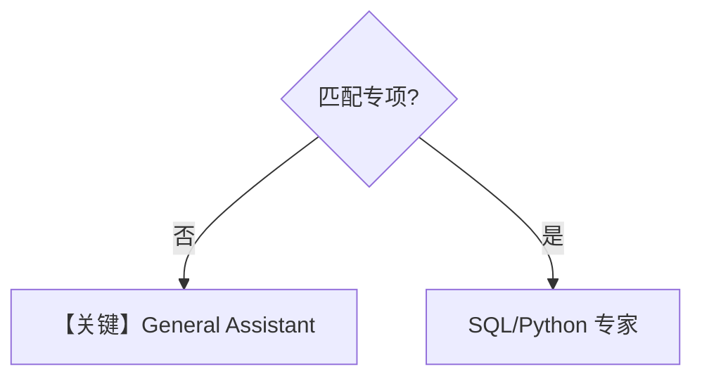

# 03_with_fallback.py — 实现原理分析

<!-- cookbook-py-source:start -->
## 完整源码

```python
"""
Route Mode with Fallback Agent

Demonstrates routing with a general-purpose fallback agent that handles
requests when no specialist is a clear match.

"""

from agno.agent import Agent
from agno.models.openai import OpenAIResponses
from agno.team.mode import TeamMode
from agno.team.team import Team

# ---------------------------------------------------------------------------
# Create Members
# ---------------------------------------------------------------------------

sql_agent = Agent(
    name="SQL Expert",
    role="Writes and optimizes SQL queries",
    model=OpenAIResponses(id="gpt-5.2"),
    instructions=[
        "You are an SQL expert.",
        "Write correct, optimized SQL queries.",
        "Explain query plans and indexing strategies when asked.",
    ],
)

python_agent = Agent(
    name="Python Expert",
    role="Writes Python code and solves Python-specific problems",
    model=OpenAIResponses(id="gpt-5.2"),
    instructions=[
        "You are a Python expert.",
        "Write idiomatic, well-structured Python code.",
        "Follow PEP 8 and use type hints.",
    ],
)

general_agent = Agent(
    name="General Assistant",
    role="Handles general questions that do not match a specialist",
    model=OpenAIResponses(id="gpt-5.2"),
    instructions=[
        "You are a helpful general assistant.",
        "Answer questions clearly and concisely.",
        "If the question is about SQL or Python, still do your best.",
    ],
)

# ---------------------------------------------------------------------------
# Create Team
# ---------------------------------------------------------------------------

team = Team(
    name="Dev Help Router",
    mode=TeamMode.route,
    model=OpenAIResponses(id="gpt-5.2"),
    members=[sql_agent, python_agent, general_agent],
    instructions=[
        "You route questions to the right expert.",
        "- SQL or database questions -> SQL Expert",
        "- Python questions -> Python Expert",
        "- Everything else -> General Assistant",
        "When in doubt, route to the General Assistant.",
    ],
    show_members_responses=True,
    markdown=True,
)

# ---------------------------------------------------------------------------
# Run Team
# ---------------------------------------------------------------------------

if __name__ == "__main__":
    # SQL question
    team.print_response(
        "Write a query to find the top 10 customers by total order value, "
        "joining the customers and orders tables.",
        stream=True,
    )

    print("\n" + "=" * 60 + "\n")

    # General question (fallback)
    team.print_response(
        "What are some good practices for code review?",
        stream=True,
    )
```

<!-- cookbook-py-source:end -->

> 源文件：`cookbook/03_teams/02_modes/route/03_with_fallback.py`

## 概述

**TeamMode.route** 带 **兜底专家**：SQL / Python / General；队长指令明确「拿不准则 General Assistant」，演示两趟 `print_response`（SQL 专项 vs 通用软技能问题）。

**核心配置一览：**

| 配置项 | 值 |
|--------|-----|
| `mode` | `TeamMode.route` |
| `members` | 含 `general_agent` |

## System Prompt 组装

```text
You route questions to the right expert.
- SQL or database questions -> SQL Expert
- Python questions -> Python Expert
- Everything else -> General Assistant
When in doubt, route to the General Assistant.

Use markdown to format your answers.
```

## Mermaid 流程图


```mermaid
flowchart TD
    D{"匹配专项?"} -->|否| F["【关键】General Assistant"]
    D -->|是| S["SQL/Python 专家"]
```

- **【关键】General Assistant**：显式 fallback 路径。

## 关键源码文件索引

| 文件 | 作用 |
|------|------|
| `agno/team/team.py` | `Team` 路由执行 |
