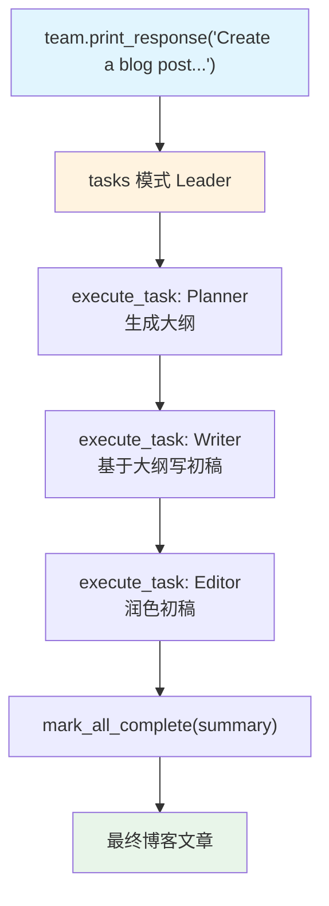

# 01_basic.py — 实现原理分析

> 源文件：`cookbook/03_teams/02_modes/tasks/01_basic.py`

## 概述

本示例展示 Agno 的 **tasks 模式顺序内容流水线**：Leader 将"写博客文章"目标分解为三个有序任务（大纲→初稿→编辑），依次委派 Planner/Writer/Editor 执行，每个任务的输出作为下一个任务的上下文输入。`max_iterations=10` 限制循环次数。

**核心配置一览：**

| 配置项 | 值 | 说明 |
|--------|------|------|
| `name` | `"Content Pipeline Team"` | Team 名称 |
| `model` | `OpenAIResponses(id="gpt-5.2")` | Leader |
| `mode` | `TeamMode.tasks` | 自主任务模式 |
| `members` | `[planner, writer, editor]` | 三名流水线成员 |
| `instructions` | `[str, str, str, str, str]` | 5 条顺序执行规则 |
| `max_iterations` | `10` | 任务循环上限 |
| `show_members_responses` | `True` | 显示每步结果 |
| `markdown` | `True` | markdown 格式 |

## 核心组件解析

### 顺序任务链（Sequential Pipeline）

Leader 的 instructions 明确规定了三步顺序：

1. **Planner** → 生成内容大纲（无依赖）
2. **Writer** → 基于大纲写初稿（依赖任务1）
3. **Editor** → 润色最终版本（依赖任务2）

Leader 使用 `execute_task` 按序执行（有依赖 → 只能顺序），不使用 `execute_tasks_parallel`。

### 任务上下文传递

每个 `execute_task` 调用的结果会被追加到后续任务的上下文中。Writer 收到的任务描述包含 Planner 输出的大纲；Editor 收到 Writer 的初稿。这是通过 `share_member_interactions` 机制或 Leader 在任务描述中手动引用实现的。

## Mermaid 流程图

## 关键源码文件索引

| 文件 | 关键函数/类 | 作用 |
|------|------------|------|
| `agno/team/mode.py` | `TeamMode.tasks` | 自主任务模式 |
| `agno/team/_messages.py` | `_get_mode_instructions()` L127 | tasks 模式工具集指南 |
| `agno/team/team.py` | `max_iterations` L107 | 循环上限 |
