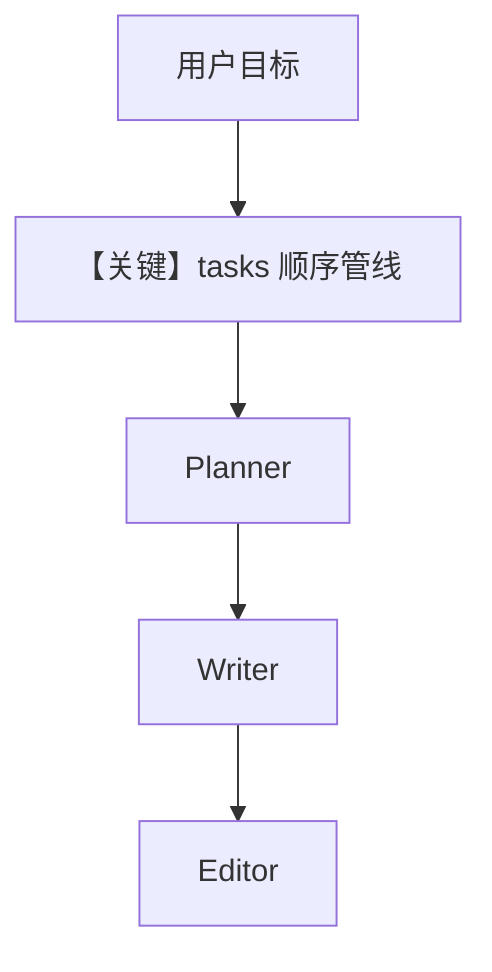

# 01_basic.py — 实现原理分析

> 源文件：`cookbook/03_teams/02_modes/tasks/01_basic.py`

## 概述

**TeamMode.tasks**：队长将目标拆解为离散任务、指派成员 **顺序执行**（Planner→Writer→Editor），最后输出编辑后成稿；`max_iterations=10`（`team.py` L106–108）限制任务循环轮数。

**核心配置一览：**

| 配置项 | 值 |
|--------|-----|
| `mode` | `TeamMode.tasks` |
| `max_iterations` | `10` |

## System Prompt 组装

```text
You are a content pipeline team leader.
For each request:
1. Create a task for the Planner to outline the content.
2. Create a task for the Writer to draft based on the outline.
3. Create a task for the Editor to polish the draft.
Execute tasks in order and provide the final edited content.

Use markdown to format your answers.
```

## Mermaid 流程图


```mermaid
flowchart TD
    G["用户目标"] --> T["【关键】tasks 顺序管线"]
    T --> P["Planner"]
    P --> W["Writer"]
    W --> E["Editor"]
```

- **【关键】tasks 顺序管线**：显式三步链。

## 关键源码文件索引

| 文件 | 作用 |
|------|------|
| `agno/team/team.py` | `max_iterations` L106-108 |
