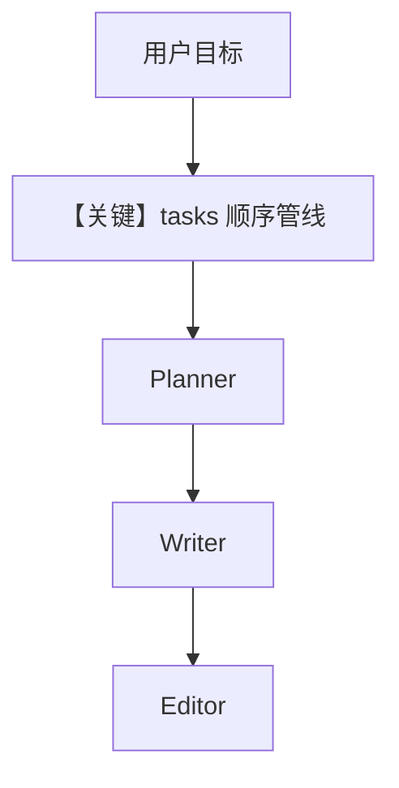

# 01_basic.py — 实现原理分析

<!-- cookbook-py-source:start -->
## 完整源码

```python
"""
Basic Tasks Mode Example

Demonstrates `mode=tasks` where the team leader autonomously:
1. Decomposes the user's goal into discrete tasks
2. Assigns each task to the best member agent
3. Executes tasks sequentially
4. Synthesizes results into a final response

"""

from agno.agent import Agent
from agno.models.openai import OpenAIResponses
from agno.team.mode import TeamMode
from agno.team.team import Team

# ---------------------------------------------------------------------------
# Create Members
# ---------------------------------------------------------------------------

planner = Agent(
    name="Planner",
    role="Creates outlines, plans, and structures for content",
    model=OpenAIResponses(id="gpt-5.2"),
    instructions=[
        "You are a planning specialist.",
        "Create clear, logical outlines and structures.",
        "Break complex topics into well-organized sections.",
    ],
)

writer = Agent(
    name="Writer",
    role="Writes polished content based on outlines or instructions",
    model=OpenAIResponses(id="gpt-5.2"),
    instructions=[
        "You are a skilled writer.",
        "Write clear, engaging content based on the provided plan or outline.",
        "Follow the structure given to you.",
    ],
)

editor = Agent(
    name="Editor",
    role="Reviews and improves content for clarity and quality",
    model=OpenAIResponses(id="gpt-5.2"),
    instructions=[
        "You are an editor.",
        "Review content for clarity, grammar, and logical flow.",
        "Provide the improved version directly.",
    ],
)

# ---------------------------------------------------------------------------
# Create Team
# ---------------------------------------------------------------------------

team = Team(
    name="Content Pipeline Team",
    mode=TeamMode.tasks,
    model=OpenAIResponses(id="gpt-5.2"),
    members=[planner, writer, editor],
    instructions=[
        "You are a content pipeline team leader.",
        "For each request:",
        "1. Create a task for the Planner to outline the content.",
        "2. Create a task for the Writer to draft based on the outline.",
        "3. Create a task for the Editor to polish the draft.",
        "Execute tasks in order and provide the final edited content.",
    ],
    show_members_responses=True,
    markdown=True,
    max_iterations=10,
)

# ---------------------------------------------------------------------------
# Run Team
# ---------------------------------------------------------------------------

if __name__ == "__main__":
    team.print_response(
        "Create a blog post explaining microservices vs monolith architecture "
        "for a technical audience."
    )
```

<!-- cookbook-py-source:end -->

> 源文件：`cookbook/03_teams/02_modes/tasks/01_basic.py`

## 概述

**TeamMode.tasks**：队长将目标拆解为离散任务、指派成员 **顺序执行**（Planner→Writer→Editor），最后输出编辑后成稿；`max_iterations=10`（`team.py` L106–108）限制任务循环轮数。

**核心配置一览：**

| 配置项 | 值 |
|--------|-----|
| `mode` | `TeamMode.tasks` |
| `max_iterations` | `10` |

## System Prompt 组装

```text
You are a content pipeline team leader.
For each request:
1. Create a task for the Planner to outline the content.
2. Create a task for the Writer to draft based on the outline.
3. Create a task for the Editor to polish the draft.
Execute tasks in order and provide the final edited content.

Use markdown to format your answers.
```

## Mermaid 流程图


```mermaid
flowchart TD
    G["用户目标"] --> T["【关键】tasks 顺序管线"]
    T --> P["Planner"]
    P --> W["Writer"]
    W --> E["Editor"]
```

- **【关键】tasks 顺序管线**：显式三步链。

## 关键源码文件索引

| 文件 | 作用 |
|------|------|
| `agno/team/team.py` | `max_iterations` L106-108 |
