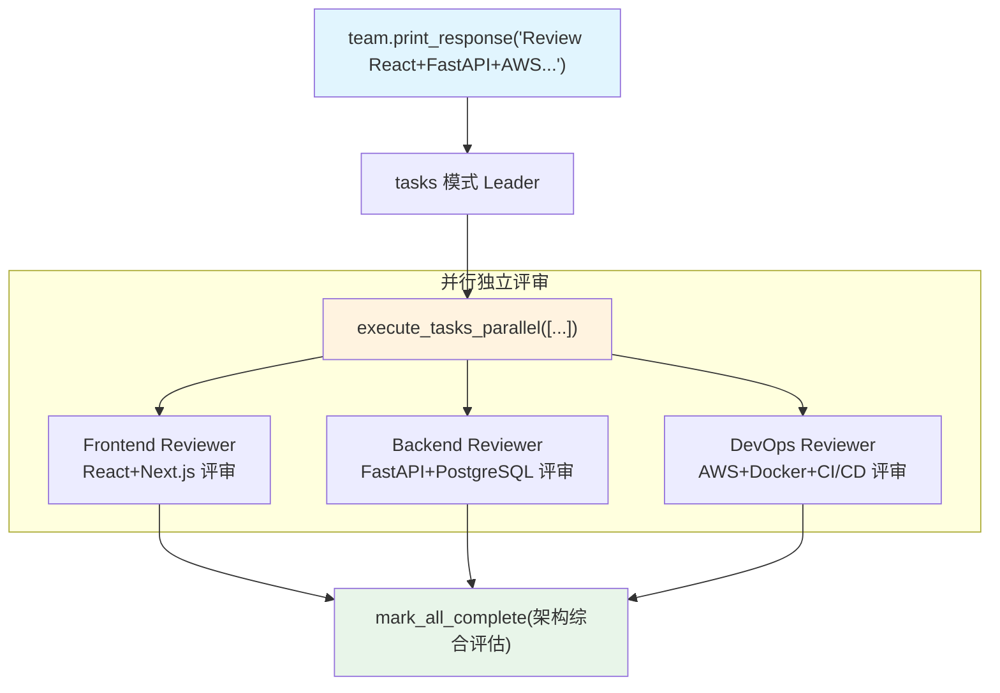

# 02_parallel.py — 实现原理分析

> 源文件：`cookbook/03_teams/02_modes/tasks/02_parallel.py`

## 概述

本示例展示 Agno 的 **tasks 模式并行执行**：三名评审员（Frontend/Backend/DevOps）对架构方案的不同维度各自独立评审，Leader 使用 `execute_tasks_parallel` 同时发起三个评审任务，所有完成后再综合。这是 tasks 模式中提升吞吐量的核心工具。

**核心配置一览：**

| 配置项 | 值 | 说明 |
|--------|------|------|
| `name` | `"Architecture Review Team"` | Team 名称 |
| `model` | `OpenAIResponses(id="gpt-5.2")` | Leader |
| `mode` | `TeamMode.tasks` | 自主任务模式 |
| `members` | `[frontend_reviewer, backend_reviewer, devops_reviewer]` | 三个独立维度 |
| `instructions` | `[str, str, str, str]` | 4 条指令（含明确并行指示） |
| `max_iterations` | `10` | 任务循环上限 |
| `show_members_responses` | `True` | 显示各维度评审 |
| `markdown` | `True` | markdown 格式 |

## 核心组件解析

### `execute_tasks_parallel` vs `execute_task`

| 工具 | 用途 | 何时使用 |
|------|------|---------|
| `execute_task` | 执行单个任务（可顺序依赖） | 有依赖关系、必须按序执行 |
| `execute_tasks_parallel` | 并行执行多个独立任务 | 任务间无依赖，可同时进行 |

本例中三个评审任务完全独立（Frontend 评审不依赖 Backend 结果），因此 Leader 的 instructions 明确指示使用 `execute_tasks_parallel`：

```python
"2. These reviews are independent -- use execute_tasks_parallel to run them concurrently."
```

### 并行任务的合并

所有并行任务完成后，Leader 调用 `mark_all_complete(summary)` 提交整合的架构评审报告。Leader 的最终响应综合了三个维度的评审发现。

## Mermaid 流程图



## 关键源码文件索引

| 文件 | 关键函数/类 | 作用 |
|------|------------|------|
| `agno/team/_default_tools.py` | `execute_tasks_parallel()` | 并行任务执行工具 |
| `agno/team/_default_tools.py` | `mark_all_complete()` | 任务完成标记 |
