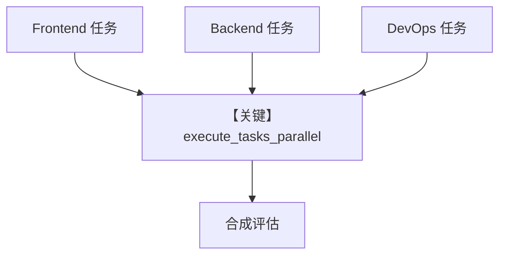

# 02_parallel.py — 实现原理分析

> 源文件：`cookbook/03_teams/02_modes/tasks/02_parallel.py`

## 概述

**TeamMode.tasks** 下 **并行任务**：队长 `instructions` 要求对架构评审创建 front/back/devops 三任务，并 **execute_tasks_parallel** 并发执行，再合成统一评估（见队长指令字面量）。

**核心配置一览：**

| 配置项 | 值 |
|--------|-----|
| `mode` | `TeamMode.tasks` |
| `max_iterations` | `10` |

## System Prompt 组装

```text
You lead an architecture review team.
When reviewing a system design:
1. Create separate tasks for frontend, backend, and devops review.
2. These reviews are independent -- use execute_tasks_parallel to run them concurrently.
3. After all reviews complete, synthesize into a unified assessment.

Use markdown to format your answers.
```

## Mermaid 流程图


```mermaid
flowchart TD
    T1["Frontend 任务"] --> P["【关键】execute_tasks_parallel"]
    T2["Backend 任务"] --> P
    T3["DevOps 任务"] --> P
    P --> S["合成评估"]
```

- **【关键】execute_tasks_parallel**：任务模式并发工具（名称以框架实现为准）。

## 关键源码文件索引

| 文件 | 作用 |
|------|------|
| `agno/team/` | tasks 模式工具定义（`execute_tasks_parallel`） |
