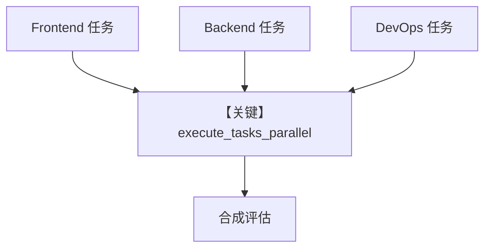

# 02_parallel.py — 实现原理分析

<!-- cookbook-py-source:start -->
## 完整源码

```python
"""
Parallel Tasks Execution Example

Demonstrates task mode with parallel execution. The team leader creates
independent tasks that can run concurrently, then synthesizes results.

"""

from agno.agent import Agent
from agno.models.openai import OpenAIResponses
from agno.team.mode import TeamMode
from agno.team.team import Team

# ---------------------------------------------------------------------------
# Create Members
# ---------------------------------------------------------------------------

frontend_reviewer = Agent(
    name="Frontend Reviewer",
    role="Reviews frontend architecture and UI patterns",
    model=OpenAIResponses(id="gpt-5.2"),
    instructions=[
        "You review frontend architecture decisions.",
        "Evaluate component patterns, state management, and UX considerations.",
        "Provide a clear assessment with recommendations.",
    ],
)

backend_reviewer = Agent(
    name="Backend Reviewer",
    role="Reviews backend architecture and API design",
    model=OpenAIResponses(id="gpt-5.2"),
    instructions=[
        "You review backend architecture decisions.",
        "Evaluate API design, data models, scalability, and security.",
        "Provide a clear assessment with recommendations.",
    ],
)

devops_reviewer = Agent(
    name="DevOps Reviewer",
    role="Reviews infrastructure and deployment strategy",
    model=OpenAIResponses(id="gpt-5.2"),
    instructions=[
        "You review infrastructure and deployment decisions.",
        "Evaluate CI/CD, hosting, monitoring, and scalability strategy.",
        "Provide a clear assessment with recommendations.",
    ],
)

# ---------------------------------------------------------------------------
# Create Team
# ---------------------------------------------------------------------------

team = Team(
    name="Architecture Review Team",
    mode=TeamMode.tasks,
    model=OpenAIResponses(id="gpt-5.2"),
    members=[frontend_reviewer, backend_reviewer, devops_reviewer],
    instructions=[
        "You lead an architecture review team.",
        "When reviewing a system design:",
        "1. Create separate tasks for frontend, backend, and devops review.",
        "2. These reviews are independent -- use execute_tasks_parallel to run them concurrently.",
        "3. After all reviews complete, synthesize into a unified assessment.",
    ],
    show_members_responses=True,
    markdown=True,
    max_iterations=10,
)

# ---------------------------------------------------------------------------
# Run Team
# ---------------------------------------------------------------------------

if __name__ == "__main__":
    team.print_response(
        "Review this architecture: A SaaS app using React + Next.js frontend, "
        "Python FastAPI backend with PostgreSQL, deployed on AWS with Docker "
        "and GitHub Actions CI/CD."
    )
```

<!-- cookbook-py-source:end -->

> 源文件：`cookbook/03_teams/02_modes/tasks/02_parallel.py`

## 概述

**TeamMode.tasks** 下 **并行任务**：队长 `instructions` 要求对架构评审创建 front/back/devops 三任务，并 **execute_tasks_parallel** 并发执行，再合成统一评估（见队长指令字面量）。

**核心配置一览：**

| 配置项 | 值 |
|--------|-----|
| `mode` | `TeamMode.tasks` |
| `max_iterations` | `10` |

## System Prompt 组装

```text
You lead an architecture review team.
When reviewing a system design:
1. Create separate tasks for frontend, backend, and devops review.
2. These reviews are independent -- use execute_tasks_parallel to run them concurrently.
3. After all reviews complete, synthesize into a unified assessment.

Use markdown to format your answers.
```

## Mermaid 流程图


```mermaid
flowchart TD
    T1["Frontend 任务"] --> P["【关键】execute_tasks_parallel"]
    T2["Backend 任务"] --> P
    T3["DevOps 任务"] --> P
    P --> S["合成评估"]
```

- **【关键】execute_tasks_parallel**：任务模式并发工具（名称以框架实现为准）。

## 关键源码文件索引

| 文件 | 作用 |
|------|------|
| `agno/team/` | tasks 模式工具定义（`execute_tasks_parallel`） |
