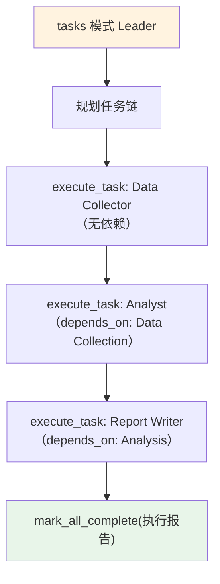

# 03_dependencies.py — 实现原理分析

> 源文件：`cookbook/03_teams/02_modes/tasks/03_dependencies.py`

## 概述

本示例展示 Agno 的 **tasks 模式 `depends_on` 依赖链**：数据收集→分析→报告写作三个任务形成严格的依赖链，Leader 使用 `depends_on` 字段确保正确的执行顺序。被依赖的任务未完成时，依赖任务处于"阻塞"状态。

**核心配置一览：**

| 配置项 | 值 | 说明 |
|--------|------|------|
| `name` | `"Research Pipeline Team"` | Team 名称 |
| `model` | `OpenAIResponses(id="gpt-5.2")` | Leader |
| `mode` | `TeamMode.tasks` | 自主任务模式 |
| `members` | `[data_collector, analyst, report_writer]` | 三步流水线 |
| `max_iterations` | `10` | 任务循环上限 |

## 核心组件解析

### `depends_on` 字段的作用

tasks 模式中，每个任务可以设置 `depends_on` 列表，指明该任务需要哪些其他任务完成后才能开始。Leader 的 instructions 明确规定：

```
1. Data Collection (no dependencies) — assign to Data Collector
2. Analysis (depends on Data Collection) — assign to Analyst
3. Report Writing (depends on Analysis) — assign to Report Writer
```

### 依赖链执行流程

1. Leader 规划出所有三个任务（含依赖关系）
2. 只有 Data Collection（无依赖）立即执行
3. Analysis 等待 Data Collection 完成后才开始
4. Report Writing 等待 Analysis 完成后才开始
5. 所有任务完成 → `mark_all_complete`

## Mermaid 流程图



## 关键源码文件索引

| 文件 | 关键函数/类 | 作用 |
|------|------------|------|
| `agno/team/_default_tools.py` | `execute_task()` | 顺序任务执行（支持 depends_on） |
| `agno/team/_default_tools.py` | `mark_all_complete()` | 完成标记 |
