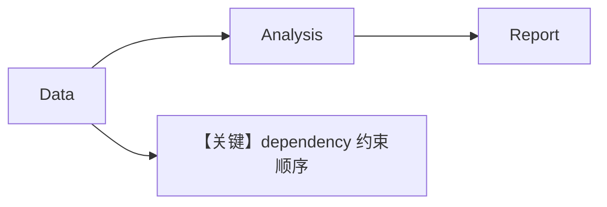

# 03_dependencies.py — 实现原理分析

<!-- cookbook-py-source:start -->
## 完整源码

```python
"""
Tasks with Dependencies Example

Demonstrates task mode with dependency chains. The team leader creates tasks
where later tasks depend on earlier ones, ensuring correct execution order.

"""

from agno.agent import Agent
from agno.models.openai import OpenAIResponses
from agno.team.mode import TeamMode
from agno.team.team import Team

# ---------------------------------------------------------------------------
# Create Members
# ---------------------------------------------------------------------------

data_collector = Agent(
    name="Data Collector",
    role="Gathers raw data and facts on a topic",
    model=OpenAIResponses(id="gpt-5.2"),
    instructions=[
        "You collect raw data and facts on the given topic.",
        "Be thorough -- gather statistics, key facts, and relevant details.",
        "Present findings as structured data points.",
    ],
)

analyst = Agent(
    name="Analyst",
    role="Analyzes data and extracts insights",
    model=OpenAIResponses(id="gpt-5.2"),
    instructions=[
        "You analyze data provided to you and extract insights.",
        "Identify trends, patterns, and notable findings.",
        "Support conclusions with the data you were given.",
    ],
)

report_writer = Agent(
    name="Report Writer",
    role="Writes polished reports from analysis results",
    model=OpenAIResponses(id="gpt-5.2"),
    instructions=[
        "You write clear, professional reports.",
        "Structure the report with an executive summary, key findings, and conclusion.",
        "Make the report accessible to a non-technical audience.",
    ],
)

# ---------------------------------------------------------------------------
# Create Team
# ---------------------------------------------------------------------------

team = Team(
    name="Research Pipeline Team",
    mode=TeamMode.tasks,
    model=OpenAIResponses(id="gpt-5.2"),
    members=[data_collector, analyst, report_writer],
    instructions=[
        "You lead a research pipeline team.",
        "Create tasks with dependencies to enforce execution order:",
        "1. Data Collection (no dependencies) -- assign to Data Collector",
        "2. Analysis (depends on Data Collection) -- assign to Analyst",
        "3. Report Writing (depends on Analysis) -- assign to Report Writer",
        "Use the dependency field when creating tasks to ensure correct ordering.",
        "Provide the final report as your response.",
    ],
    show_members_responses=True,
    markdown=True,
    max_iterations=10,
)

# ---------------------------------------------------------------------------
# Run Team
# ---------------------------------------------------------------------------

if __name__ == "__main__":
    team.print_response(
        "Research the global renewable energy market: gather key data, "
        "analyze trends, and produce a brief executive report."
    )
```

<!-- cookbook-py-source:end -->

> 源文件：`cookbook/03_teams/02_modes/tasks/03_dependencies.py`

## 概述

**TeamMode.tasks** 带 **任务依赖链**：采集 → 分析 → 报告，队长指令要求创建任务时使用 dependency 字段保证顺序（Data → Analyst → Report Writer）。

**核心配置一览：**

| 配置项 | 值 |
|--------|-----|
| `mode` | `TeamMode.tasks` |
| `max_iterations` | `10` |

## System Prompt 组装

```text
You lead a research pipeline team.
Create tasks with dependencies to enforce execution order:
1. Data Collection (no dependencies) -- assign to Data Collector
2. Analysis (depends on Data Collection) -- assign to Analyst
3. Report Writing (depends on Analysis) -- assign to Report Writer
Use the dependency field when creating tasks to ensure correct ordering.
Provide the final report as your response.

Use markdown to format your answers.
```

## Mermaid 流程图


```mermaid
flowchart LR
    D["Data"] --> A["Analysis"]
    A --> R["Report"]
    D --> K["【关键】dependency 约束顺序"]
```

- **【关键】dependency 约束顺序**：相对纯并行 tasks 的差异点。

## 关键源码文件索引

| 文件 | 作用 |
|------|------|
| `agno/team/` | 任务 DAG 执行 |
