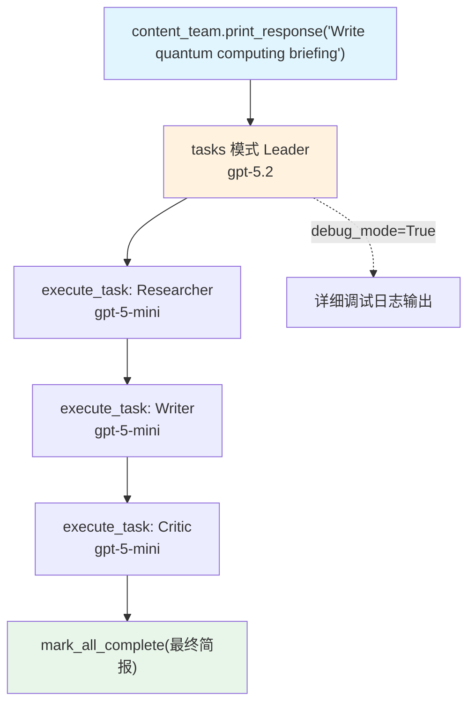

# 04_basic_task_mode.py — 实现原理分析

> 源文件：`cookbook/03_teams/02_modes/tasks/04_basic_task_mode.py`

## 概述

本示例展示 Agno 的 **tasks 模式 + debug_mode**：Researcher/Writer/Critic 三个角色执行研究-写作-评审的内容生产流程。`debug_mode=True` 开启详细日志，可观察 Leader 的规划决策、工具调用参数和成员交互全过程。

**核心配置一览：**

| 配置项 | 值 | 说明 |
|--------|------|------|
| `name` | `"Content Creation Team"` | Team 名称 |
| `model` | `OpenAIResponses(id="gpt-5.2")` | Leader |
| `mode` | `TeamMode.tasks` | 自主任务模式 |
| `members` | `[researcher, writer, critic]` | 三名成员（均用 gpt-5-mini） |
| `max_iterations` | `10` | 任务循环上限 |
| `debug_mode` | `True` | 开启详细调试日志 |
| `show_members_responses` | `True` | 显示成员响应 |

## 核心组件解析

### Leader vs 成员的模型差异

本例展示了常见的优化模式：

| 角色 | 模型 | 原因 |
|------|------|------|
| Team Leader | `gpt-5.2`（强） | 负责任务规划和综合，需要高推理能力 |
| 所有成员 | `gpt-5-mini`（快） | 执行具体子任务，使用轻量模型降低成本 |

### `debug_mode=True` 的输出内容

开启后，日志中会显示：
- Leader 发送给各成员的完整任务描述
- 每次 `execute_task` / `mark_all_complete` 的调用参数
- 成员 Agent 的 API 请求（含 messages 和 tools）
- Token 使用统计

## Mermaid 流程图

## 关键源码文件索引

| 文件 | 关键函数/类 | 作用 |
|------|------------|------|
| `agno/team/team.py` | `debug_mode` L346 | 调试日志开关 |
| `agno/team/_default_tools.py` | `execute_task()` | 顺序任务执行 |
