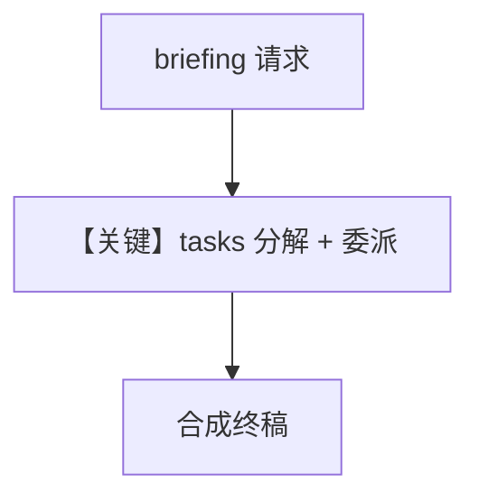

# 04_basic_task_mode.py — 实现原理分析

> 源文件：`cookbook/03_teams/02_modes/tasks/04_basic_task_mode.py`

## 概述

**TeamMode.tasks** 基础模板：Researcher / Writer / Critic 三角色，`debug_mode=True` 便于调试任务分解；`max_iterations=10`。

**核心配置一览：**

| 配置项 | 值 |
|--------|-----|
| `mode` | `TeamMode.tasks` |
| `debug_mode` | `True` |
| 成员模型 | 多为 `gpt-5-mini`，队长 `gpt-5.2` |

## System Prompt 组装

```text
You are a content creation team leader.
Break down the user's request into research, writing, and review tasks.
Assign each task to the most appropriate team member.
After all tasks are complete, synthesize the results into a final response.

Use markdown to format your answers.
```

## Mermaid 流程图


```mermaid
flowchart TD
    U["briefing 请求"] --> L["【关键】tasks 分解 + 委派"]
    L --> Z["合成终稿"]
```

- **【关键】tasks 分解 + 委派**：与 `01_basic` 同属任务模式，成员角色不同。

## 关键源码文件索引

| 文件 | 作用 |
|------|------|
| `agno/team/team.py` | `debug_mode` |
