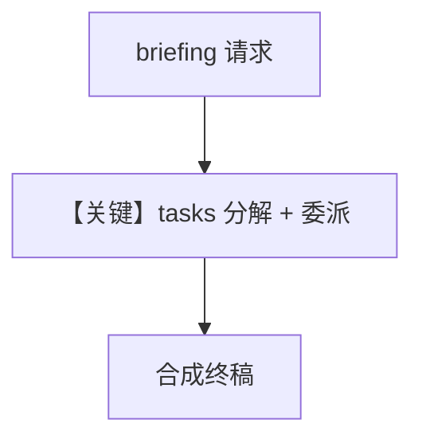

# 04_basic_task_mode.py — 实现原理分析

<!-- cookbook-py-source:start -->
## 完整源码

```python
"""
Basic Task Mode Example

Demonstrates a team in `mode=tasks` where the team leader autonomously:
1. Decomposes a user goal into discrete tasks
2. Assigns tasks to the most suitable member agent
3. Executes tasks by delegating to members
4. Collects results and provides a final summary

Run: .venvs/demo/bin/python cookbook/03_teams/02_modes/tasks/04_basic_task_mode.py
"""

from agno.agent import Agent
from agno.models.openai import OpenAIResponses
from agno.team.mode import TeamMode
from agno.team.team import Team

# ---------------------------------------------------------------------------
# Create Members
# ---------------------------------------------------------------------------

researcher = Agent(
    name="Researcher",
    role="Research specialist who finds information on topics",
    model=OpenAIResponses(id="gpt-5-mini"),
    instructions=[
        "You are a research specialist.",
        "When given a topic, provide a clear, concise summary of key facts.",
        "Always cite what you know and be honest about limitations.",
    ],
)

writer = Agent(
    name="Writer",
    role="Content writer who creates well-structured text",
    model=OpenAIResponses(id="gpt-5-mini"),
    instructions=[
        "You are a skilled content writer.",
        "Take provided information and craft it into polished, engaging text.",
        "Use clear structure with headers and bullet points when appropriate.",
    ],
)

critic = Agent(
    name="Critic",
    role="Quality reviewer who provides constructive feedback",
    model=OpenAIResponses(id="gpt-5-mini"),
    instructions=[
        "You are a constructive critic.",
        "Review content for accuracy, clarity, and completeness.",
        "Provide specific, actionable feedback.",
    ],
)

# ---------------------------------------------------------------------------
# Create Team
# ---------------------------------------------------------------------------

content_team = Team(
    name="Content Creation Team",
    mode=TeamMode.tasks,
    model=OpenAIResponses(id="gpt-5.2"),
    members=[researcher, writer, critic],
    instructions=[
        "You are a content creation team leader.",
        "Break down the user's request into research, writing, and review tasks.",
        "Assign each task to the most appropriate team member.",
        "After all tasks are complete, synthesize the results into a final response.",
    ],
    show_members_responses=True,
    markdown=True,
    max_iterations=10,
    debug_mode=True,
)

# ---------------------------------------------------------------------------
# Run Team
# ---------------------------------------------------------------------------

if __name__ == "__main__":
    content_team.print_response(
        "Write a short briefing on the current state of quantum computing, "
        "covering recent breakthroughs, key challenges, and potential near-term applications."
    )
```

<!-- cookbook-py-source:end -->

> 源文件：`cookbook/03_teams/02_modes/tasks/04_basic_task_mode.py`

## 概述

**TeamMode.tasks** 基础模板：Researcher / Writer / Critic 三角色，`debug_mode=True` 便于调试任务分解；`max_iterations=10`。

**核心配置一览：**

| 配置项 | 值 |
|--------|-----|
| `mode` | `TeamMode.tasks` |
| `debug_mode` | `True` |
| 成员模型 | 多为 `gpt-5-mini`，队长 `gpt-5.2` |

## System Prompt 组装

```text
You are a content creation team leader.
Break down the user's request into research, writing, and review tasks.
Assign each task to the most appropriate team member.
After all tasks are complete, synthesize the results into a final response.

Use markdown to format your answers.
```

## Mermaid 流程图


```mermaid
flowchart TD
    U["briefing 请求"] --> L["【关键】tasks 分解 + 委派"]
    L --> Z["合成终稿"]
```

- **【关键】tasks 分解 + 委派**：与 `01_basic` 同属任务模式，成员角色不同。

## 关键源码文件索引

| 文件 | 作用 |
|------|------|
| `agno/team/team.py` | `debug_mode` |
