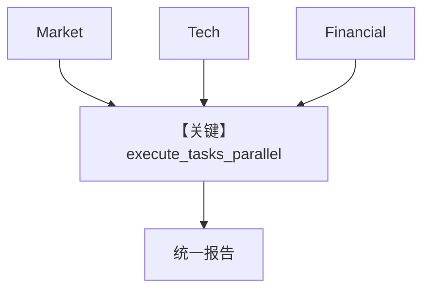

# 05_parallel_tasks.py — 实现原理分析

<!-- cookbook-py-source:start -->
## 完整源码

```python
"""
Parallel Task Execution Example

Demonstrates the `execute_tasks_parallel` tool in task mode. The team leader
creates multiple independent tasks and executes them concurrently, then
synthesizes the results.

Run: .venvs/demo/bin/python cookbook/03_teams/02_modes/tasks/05_parallel_tasks.py
"""

from agno.agent import Agent
from agno.models.openai import OpenAIResponses
from agno.team.mode import TeamMode
from agno.team.team import Team

# ---------------------------------------------------------------------------
# Create Members
# ---------------------------------------------------------------------------

market_analyst = Agent(
    name="Market Analyst",
    role="Analyzes market trends and competitive landscape",
    model=OpenAIResponses(id="gpt-5-mini"),
    instructions=[
        "You are a market analyst.",
        "Provide concise analysis of market trends, key players, and outlook.",
    ],
)

tech_analyst = Agent(
    name="Tech Analyst",
    role="Evaluates technical feasibility and innovation",
    model=OpenAIResponses(id="gpt-5-mini"),
    instructions=[
        "You are a technology analyst.",
        "Evaluate technical aspects, innovation potential, and feasibility.",
    ],
)

financial_analyst = Agent(
    name="Financial Analyst",
    role="Assesses financial viability and investment potential",
    model=OpenAIResponses(id="gpt-5-mini"),
    instructions=[
        "You are a financial analyst.",
        "Assess financial viability, revenue potential, and investment outlook.",
    ],
)

# ---------------------------------------------------------------------------
# Create Team
# ---------------------------------------------------------------------------

analysis_team = Team(
    name="Industry Analysis Team",
    mode=TeamMode.tasks,
    model=OpenAIResponses(id="gpt-5.2"),
    members=[market_analyst, tech_analyst, financial_analyst],
    instructions=[
        "You are an industry analysis team leader.",
        "When given a topic to analyze:",
        "1. Create separate tasks for market analysis, tech analysis, and financial analysis.",
        "2. These tasks are independent -- use `execute_tasks_parallel` to run them concurrently.",
        "3. After all parallel tasks complete, synthesize findings into a unified report.",
        "Prefer parallel execution whenever tasks do not depend on each other.",
    ],
    show_members_responses=True,
    markdown=True,
    max_iterations=10,
)

# ---------------------------------------------------------------------------
# Run Team
# ---------------------------------------------------------------------------

if __name__ == "__main__":
    analysis_team.print_response(
        "Analyze the electric vehicle industry for a potential investor. "
        "Cover market dynamics, technological innovations, and financial outlook."
    )
```

<!-- cookbook-py-source:end -->

> 源文件：`cookbook/03_teams/02_modes/tasks/05_parallel_tasks.py`

## 概述

与 `02_parallel.py` 同主题：**execute_tasks_parallel** 并行市场/技术/财务分析，再合并投资视角报告；强调 **独立任务优先并行**。

**核心配置一览：**

| 配置项 | 值 |
|--------|-----|
| `mode` | `TeamMode.tasks` |

## System Prompt 组装

```text
You are an industry analysis team leader.
When given a topic to analyze:
1. Create separate tasks for market analysis, tech analysis, and financial analysis.
2. These tasks are independent -- use `execute_tasks_parallel` to run them concurrently.
3. After all parallel tasks complete, synthesize findings into a unified report.
Prefer parallel execution whenever tasks do not depend on each other.

Use markdown to format your answers.
```

## Mermaid 流程图



- **【关键】execute_tasks_parallel**：并行三相分析。

## 关键源码文件索引

| 文件 | 作用 |
|------|------|
| `agno/team/` | 并行任务工具 |
