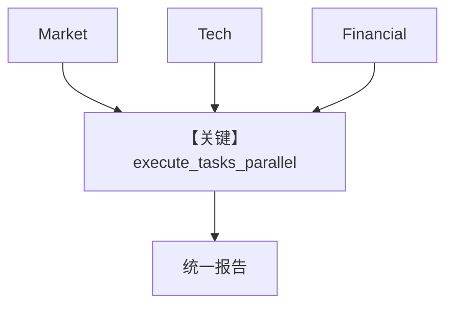

# 05_parallel_tasks.py — 实现原理分析

> 源文件：`cookbook/03_teams/02_modes/tasks/05_parallel_tasks.py`

## 概述

与 `02_parallel.py` 同主题：**execute_tasks_parallel** 并行市场/技术/财务分析，再合并投资视角报告；强调 **独立任务优先并行**。

**核心配置一览：**

| 配置项 | 值 |
|--------|-----|
| `mode` | `TeamMode.tasks` |

## System Prompt 组装

```text
You are an industry analysis team leader.
When given a topic to analyze:
1. Create separate tasks for market analysis, tech analysis, and financial analysis.
2. These tasks are independent -- use `execute_tasks_parallel` to run them concurrently.
3. After all parallel tasks complete, synthesize findings into a unified report.
Prefer parallel execution whenever tasks do not depend on each other.

Use markdown to format your answers.
```

## Mermaid 流程图



- **【关键】execute_tasks_parallel**：并行三相分析。

## 关键源码文件索引

| 文件 | 作用 |
|------|------|
| `agno/team/` | 并行任务工具 |
