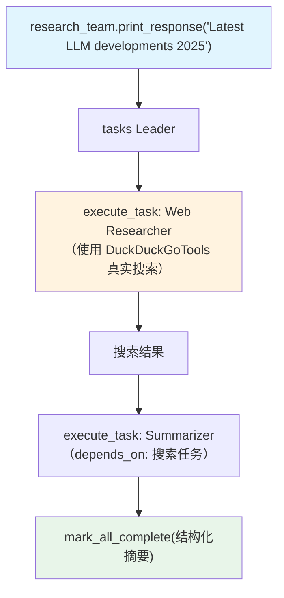

# 06_task_mode_with_tools.py — 实现原理分析

> 源文件：`cookbook/03_teams/02_modes/tasks/06_task_mode_with_tools.py`

## 概述

本示例展示 Agno 的 **tasks 模式 + 工具成员**：Web Researcher 持有 DuckDuckGoTools 进行真实网络搜索，Summarizer 对搜索结果提炼摘要。Leader 通过 `depends_on` 确保先搜索后摘要的顺序，展示 tasks 模式如何协调有工具的成员完成实际信息获取任务。

**核心配置一览：**

| 配置项 | 值 | 说明 |
|--------|------|------|
| `name` | `"Research Team"` | Team 名称 |
| `model` | `OpenAIResponses(id="gpt-5.2")` | Leader |
| `mode` | `TeamMode.tasks` | 自主任务模式 |
| `members` | `[web_researcher, summarizer]` | 研究员（有工具）+ 摘要员 |
| `max_iterations` | `10` | 循环上限 |
| `show_members_responses` | `True` | 显示搜索和摘要结果 |

| 成员 | `name` | `model` | `tools` |
|------|--------|---------|---------|
| web_researcher | `"Web Researcher"` | `gpt-5-mini` | `[DuckDuckGoTools()]` |
| summarizer | `"Summarizer"` | `gpt-5-mini` | 无 |

## 核心组件解析

### 工具成员在 tasks 模式中的行为

Web Researcher 在执行分配到的任务时，会自主决定如何使用 DuckDuckGoTools 进行搜索。Leader 不感知具体搜索关键词，只知道"Web Researcher 会去搜索"。

成员工具调用流程：
1. Leader `execute_task(web_researcher, "Search for LLM news 2025")`
2. Web Researcher 内部调用 `duckduckgo_search(query="...")`
3. 搜索结果整合后返回给 Leader（或追加到 Summarizer 的上下文）

### 依赖关系设计

```
摘要任务 depends_on [搜索任务]
```

Summarizer 只有在 Web Researcher 完成搜索并返回结果后才启动，确保摘要基于真实搜索内容。

## Mermaid 流程图



## 关键源码文件索引

| 文件 | 关键函数/类 | 作用 |
|------|------------|------|
| `agno/tools/duckduckgo.py` | `DuckDuckGoTools` | 网络搜索工具 |
| `agno/team/_default_tools.py` | `execute_task()` | 有依赖的顺序执行 |
