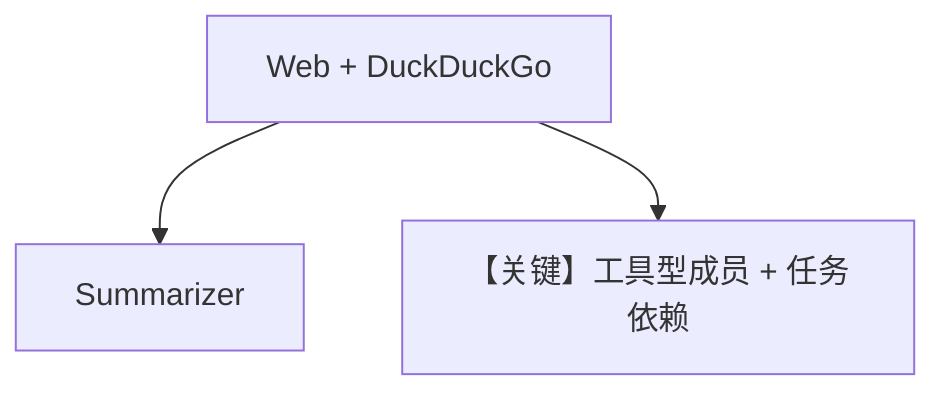

# 06_task_mode_with_tools.py — 实现原理分析

<!-- cookbook-py-source:start -->
## 完整源码

```python
"""
Task Mode with Tool-Equipped Agents

Demonstrates task mode where member agents have real tools. The team leader
creates tasks and delegates them to agents that use web search to gather
information.

Run: .venvs/demo/bin/python cookbook/03_teams/02_modes/tasks/06_task_mode_with_tools.py
"""

from agno.agent import Agent
from agno.models.openai import OpenAIResponses
from agno.team.mode import TeamMode
from agno.team.team import Team
from agno.tools.duckduckgo import DuckDuckGoTools

# ---------------------------------------------------------------------------
# Create Members
# ---------------------------------------------------------------------------

web_researcher = Agent(
    name="Web Researcher",
    role="Searches the web for current information",
    model=OpenAIResponses(id="gpt-5-mini"),
    tools=[DuckDuckGoTools()],
    instructions=[
        "You are a web researcher.",
        "Use DuckDuckGo to search for current, relevant information.",
        "Summarize findings clearly with key facts and sources.",
    ],
)

summarizer = Agent(
    name="Summarizer",
    role="Synthesizes information into clear summaries",
    model=OpenAIResponses(id="gpt-5-mini"),
    instructions=[
        "You are an expert summarizer.",
        "Take detailed information and distill it into a clear, structured summary.",
        "Highlight the most important points.",
    ],
)

# ---------------------------------------------------------------------------
# Create Team
# ---------------------------------------------------------------------------

research_team = Team(
    name="Research Team",
    mode=TeamMode.tasks,
    model=OpenAIResponses(id="gpt-5.2"),
    members=[web_researcher, summarizer],
    instructions=[
        "You are a research team leader.",
        "For research requests:",
        "1. Create search tasks for the Web Researcher to gather information.",
        "2. Once research is done, create a task for the Summarizer to compile findings.",
        "3. Set proper dependencies -- summarization depends on research being complete.",
    ],
    show_members_responses=True,
    markdown=True,
    max_iterations=10,
)

# ---------------------------------------------------------------------------
# Run Team
# ---------------------------------------------------------------------------

if __name__ == "__main__":
    research_team.print_response(
        "What are the latest developments in large language models in 2025? "
        "Find recent news and provide a structured summary."
    )
```

<!-- cookbook-py-source:end -->

> 源文件：`cookbook/03_teams/02_modes/tasks/06_task_mode_with_tools.py`

## 概述

**TeamMode.tasks** 与 **成员工具**：`Web Researcher` 配备 `DuckDuckGoTools`，先搜索再交给 `Summarizer`；队长指令要求 **依赖**：摘要任务依赖研究完成。

**核心配置一览：**

| 配置项 | 值 |
|--------|-----|
| `mode` | `TeamMode.tasks` |
| `tools` | 成员 `DuckDuckGoTools()` |

## System Prompt 组装

```text
You are a research team leader.
For research requests:
1. Create search tasks for the Web Researcher to gather information.
2. Once research is done, create a task for the Summarizer to compile findings.
3. Set proper dependencies -- summarization depends on research being complete.

Use markdown to format your answers.
```

## Mermaid 流程图


```mermaid
flowchart TD
    R["Web + DuckDuckGo"] --> S["Summarizer"]
    R --> K["【关键】工具型成员 + 任务依赖"]
```

- **【关键】工具型成员 + 任务依赖**：搜索与纯文本成员串联。

## 关键源码文件索引

| 文件 | 作用 |
|------|------|
| `agno/tools/duckduckgo` | `DuckDuckGoTools` |
