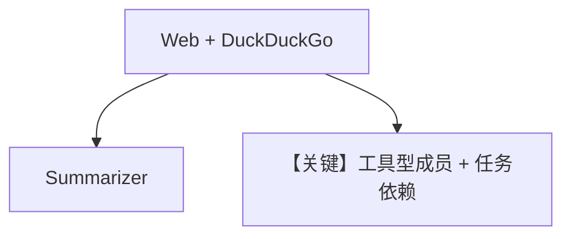

# 06_task_mode_with_tools.py — 实现原理分析

> 源文件：`cookbook/03_teams/02_modes/tasks/06_task_mode_with_tools.py`

## 概述

**TeamMode.tasks** 与 **成员工具**：`Web Researcher` 配备 `DuckDuckGoTools`，先搜索再交给 `Summarizer`；队长指令要求 **依赖**：摘要任务依赖研究完成。

**核心配置一览：**

| 配置项 | 值 |
|--------|-----|
| `mode` | `TeamMode.tasks` |
| `tools` | 成员 `DuckDuckGoTools()` |

## System Prompt 组装

```text
You are a research team leader.
For research requests:
1. Create search tasks for the Web Researcher to gather information.
2. Once research is done, create a task for the Summarizer to compile findings.
3. Set proper dependencies -- summarization depends on research being complete.

Use markdown to format your answers.
```

## Mermaid 流程图


```mermaid
flowchart TD
    R["Web + DuckDuckGo"] --> S["Summarizer"]
    R --> K["【关键】工具型成员 + 任务依赖"]
```

- **【关键】工具型成员 + 任务依赖**：搜索与纯文本成员串联。

## 关键源码文件索引

| 文件 | 作用 |
|------|------|
| `agno/tools/duckduckgo` | `DuckDuckGoTools` |
